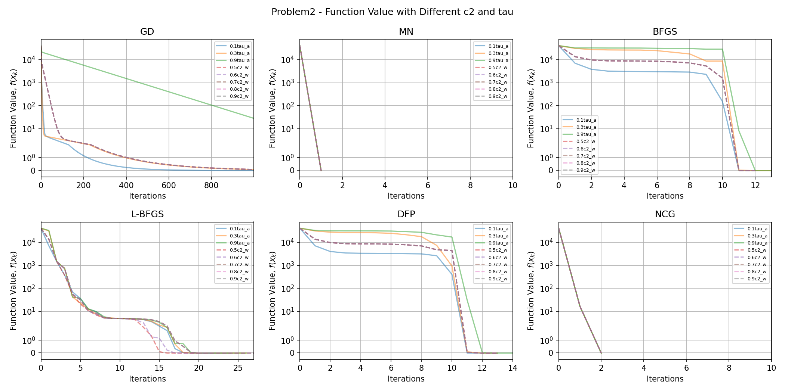
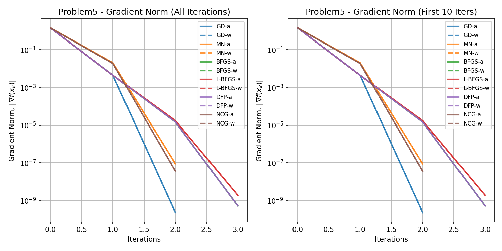
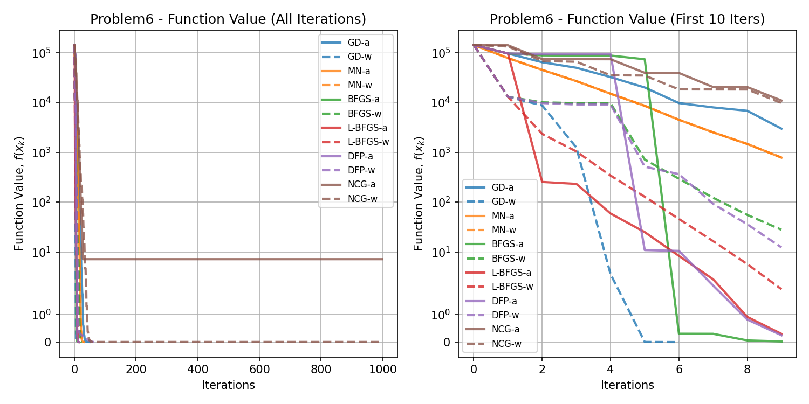
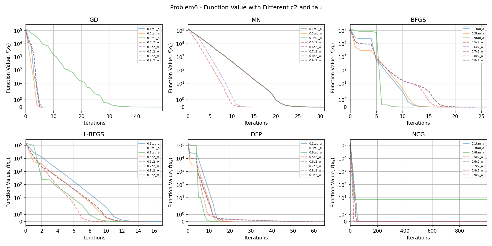
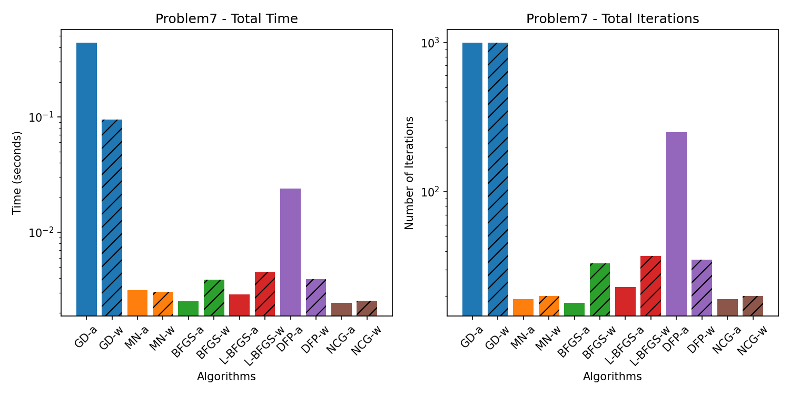
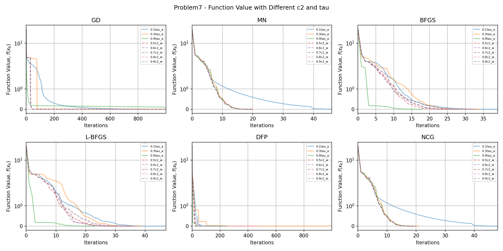
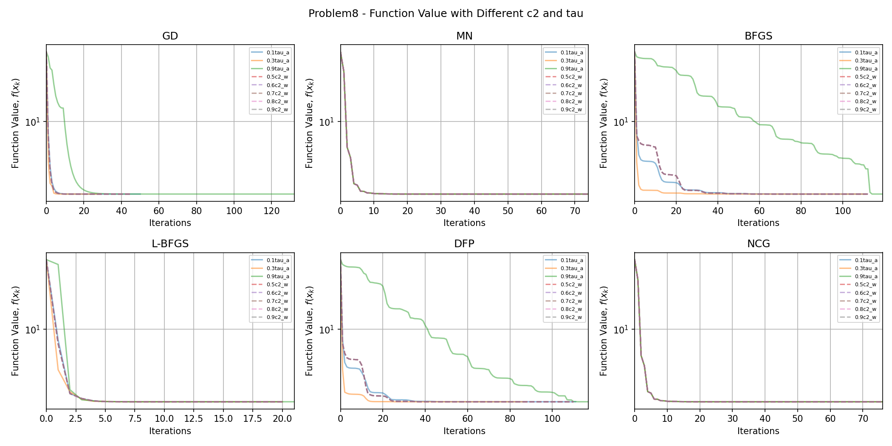
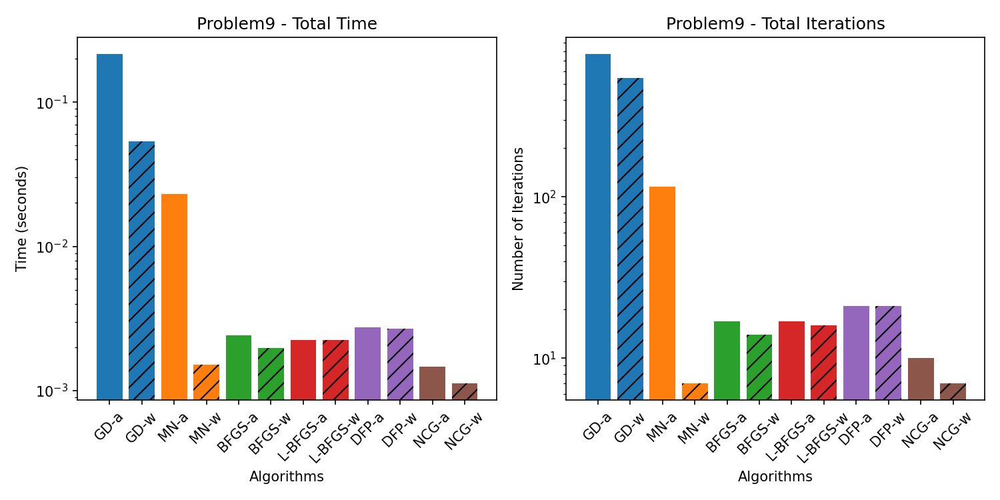
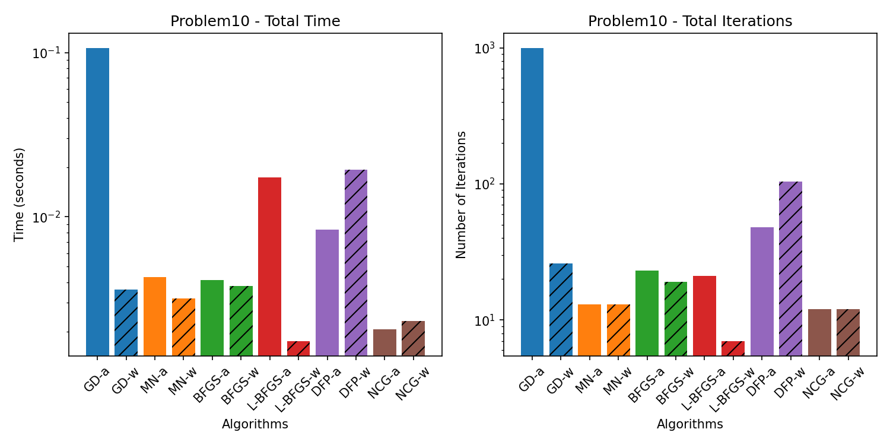

# Algorithms for Non-Linear Programming

## This repository contains implementations of various algorithms for solving non-linear programming problems.

### Getting Started

Install Python 3.10
```bash
sudo apt-get install python3.10-full
```

Install Venv Package
```bash
sudo apt-get install python3-venv
```

Create a virtual environment
```bash
python3.10 -m venv env
```

Activate the virtual environment
```bash
source env/bin/activate
```

Install the required packages
```bash
pip install -r requirements.txt
```

### How to Use

Run the specific problem script, for example:
```bash
python problem1.py
```

or run the main script to execute all problems:
```bash
python run_all_problems.py
```

To convert the markdown file to a PDF, use the following command:
```bash
pandoc README.md -o README.pdf -V geometry:margin=0.5in
```

## Results

Plots for each problem will be saved in the `figures` directory. Data for each problem will be saved in the `data` directory.

### Problem 1

<!-- BEGIN_Problem1_TABLE -->
|          |   Iters |        Time | Convergence                                  |   Func Evals |   Grad Evals |   Hess Evals |
|:---------|--------:|------------:|:---------------------------------------------|-------------:|-------------:|-------------:|
| GD-a     |      89 | 0.00755811  | Converged. Gradient norm is below tolerance. |         1599 |          179 |            0 |
| GD-w     |      46 | 0.00142407  | Converged. Gradient norm is below tolerance. |          202 |           47 |            0 |
| MN-a     |       1 | 0.000280142 | Converged. Gradient norm is below tolerance. |            3 |            4 |            2 |
| MN-w     |       1 | 0.00111628  | Converged. Gradient norm is below tolerance. |            3 |            3 |            2 |
| BFGS-a   |      21 | 0.00352502  | Converged. Gradient norm is below tolerance. |           92 |           65 |            0 |
| BFGS-w   |      18 | 0.00404596  | Converged. Gradient norm is below tolerance. |           49 |           38 |            0 |
| L-BFGS-a |      15 | 0.00113106  | Converged. Gradient norm is below tolerance. |           44 |           46 |            0 |
| L-BFGS-w |      15 | 0.00218797  | Converged. Gradient norm is below tolerance. |           33 |           31 |            0 |
| DFP-a    |      18 | 0.00428891  | Converged. Gradient norm is below tolerance. |           58 |           56 |            0 |
| DFP-w    |      18 | 0.0018599   | Converged. Gradient norm is below tolerance. |           41 |           38 |            0 |
| NCG-a    |       3 | 0.000470161 | Converged. Gradient norm is below tolerance. |            7 |            8 |            4 |
| NCG-w    |       3 | 0.000382185 | Converged. Gradient norm is below tolerance. |            7 |            5 |            4 |
<!-- END_Problem1_TABLE -->


### Problem 2

<!-- BEGIN_Problem2_TABLE -->
|          |   Iters |        Time | Convergence                                  |   Func Evals |   Grad Evals |   Hess Evals |
|:---------|--------:|------------:|:---------------------------------------------|-------------:|-------------:|-------------:|
| GD-a     |     999 | 0.252092    | Failed. Maximum iterations reached.          |        60998 |         2000 |            0 |
| GD-w     |     999 | 0.0526028   | Failed. Maximum iterations reached.          |        10965 |         1000 |            0 |
| MN-a     |       1 | 0.000405073 | Converged. Gradient norm is below tolerance. |            3 |            4 |            2 |
| MN-w     |       1 | 0.000128031 | Converged. Gradient norm is below tolerance. |            3 |            3 |            2 |
| BFGS-a   |      13 | 0.00546694  | Converged. Gradient norm is below tolerance. |          489 |           41 |            0 |
| BFGS-w   |      12 | 0.00343227  | Converged. Gradient norm is below tolerance. |          100 |           26 |            0 |
| L-BFGS-a |      26 | 0.00606179  | Converged. Gradient norm is below tolerance. |          114 |           79 |            0 |
| L-BFGS-w |      27 | 0.00766802  | Converged. Gradient norm is below tolerance. |           67 |           55 |            0 |
| DFP-a    |      14 | 0.00673199  | Converged. Gradient norm is below tolerance. |          321 |           44 |            0 |
| DFP-w    |      13 | 0.00117803  | Converged. Gradient norm is below tolerance. |           81 |           28 |            0 |
| NCG-a    |       2 | 0.00108004  | Converged. Gradient norm is below tolerance. |            5 |            6 |            3 |
| NCG-w    |       2 | 0.000996113 | Converged. Gradient norm is below tolerance. |            5 |            4 |            3 |
<!-- END_Problem2_TABLE -->





### Problem 3

<!-- BEGIN_Problem3_TABLE -->
|          |   Iters |      Time | Convergence                                  |   Func Evals |   Grad Evals |   Hess Evals |
|:---------|--------:|----------:|:---------------------------------------------|-------------:|-------------:|-------------:|
| GD-a     |      88 |  0.988567 | Converged. Gradient norm is below tolerance. |         1574 |          177 |            0 |
| GD-w     |      41 |  0.127204 | Converged. Gradient norm is below tolerance. |          180 |           42 |            0 |
| MN-a     |       1 |  1.11052  | Converged. Gradient norm is below tolerance. |            3 |            4 |            2 |
| MN-w     |       1 |  1.20483  | Converged. Gradient norm is below tolerance. |            3 |            3 |            2 |
| BFGS-a   |     227 | 20.2828   | Converged. Gradient norm is below tolerance. |         1361 |          683 |            0 |
| BFGS-w   |      59 |  4.3017   | Converged. Gradient norm is below tolerance. |          179 |          120 |            0 |
| L-BFGS-a |      21 |  0.120776 | Converged. Gradient norm is below tolerance. |           59 |           64 |            0 |
| L-BFGS-w |      21 |  0.113118 | Converged. Gradient norm is below tolerance. |           46 |           43 |            0 |
| DFP-a    |     104 |  7.60348  | Converged. Gradient norm is below tolerance. |          229 |          314 |            0 |
| DFP-w    |      29 |  2.22801  | Converged. Gradient norm is below tolerance. |           88 |           60 |            0 |
| NCG-a    |       3 |  0.130366 | Converged. Gradient norm is below tolerance. |            7 |            8 |            4 |
| NCG-w    |       3 |  0.082679 | Converged. Gradient norm is below tolerance. |            7 |            5 |            4 |
<!-- END_Problem3_TABLE -->


### Problem 4

<!-- BEGIN_Problem4_TABLE -->
|          |   Iters |      Time | Convergence                                  |   Func Evals |   Grad Evals |   Hess Evals |
|:---------|--------:|----------:|:---------------------------------------------|-------------:|-------------:|-------------:|
| GD-a     |     999 | 39.1296   | Failed. Maximum iterations reached.          |        60997 |         2000 |            0 |
| GD-w     |     999 |  6.61219  | Failed. Maximum iterations reached.          |        10965 |         1000 |            0 |
| MN-a     |       1 |  1.71668  | Converged. Gradient norm is below tolerance. |            3 |            4 |            2 |
| MN-w     |       1 |  1.34531  | Converged. Gradient norm is below tolerance. |            3 |            3 |            2 |
| BFGS-a   |     999 | 92.4884   | Failed. Maximum iterations reached.          |        47132 |         3001 |            0 |
| BFGS-w   |     508 | 38.4789   | Converged. Gradient norm is below tolerance. |         4779 |         1018 |            0 |
| L-BFGS-a |     123 |  0.798157 | Converged. Gradient norm is below tolerance. |          316 |          370 |            0 |
| L-BFGS-w |     126 |  0.598031 | Converged. Gradient norm is below tolerance. |          267 |          253 |            0 |
| DFP-a    |     857 | 60.6716   | Converged. Gradient norm is below tolerance. |        19277 |         2573 |            0 |
| DFP-w    |     288 | 18.4669   | Converged. Gradient norm is below tolerance. |         1750 |          578 |            0 |
| NCG-a    |       3 |  0.465677 | Converged. Gradient norm is below tolerance. |            7 |            8 |            4 |
| NCG-w    |       3 |  0.400016 | Converged. Gradient norm is below tolerance. |            7 |            5 |            4 |
<!-- END_Problem4_TABLE -->


### Problem 5

<!-- BEGIN_Problem5_TABLE -->
|          |   Iters |        Time | Convergence                                  |   Func Evals |   Grad Evals |   Hess Evals |
|:---------|--------:|------------:|:---------------------------------------------|-------------:|-------------:|-------------:|
| GD-a     |       2 | 0.00013113  | Converged. Gradient norm is below tolerance. |            5 |            5 |            0 |
| GD-w     |       2 | 8.89301e-05 | Converged. Gradient norm is below tolerance. |            5 |            3 |            0 |
| MN-a     |       2 | 0.000264883 | Converged. Gradient norm is below tolerance. |            5 |            6 |            3 |
| MN-w     |       2 | 0.000184059 | Converged. Gradient norm is below tolerance. |            5 |            4 |            3 |
| BFGS-a   |       3 | 0.000221968 | Converged. Gradient norm is below tolerance. |            7 |           11 |            0 |
| BFGS-w   |       3 | 0.00018096  | Converged. Gradient norm is below tolerance. |            7 |            8 |            0 |
| L-BFGS-a |       3 | 0.000173092 | Converged. Gradient norm is below tolerance. |            7 |           10 |            0 |
| L-BFGS-w |       3 | 0.00019002  | Converged. Gradient norm is below tolerance. |            7 |            7 |            0 |
| DFP-a    |       3 | 0.000157833 | Converged. Gradient norm is below tolerance. |            7 |           11 |            0 |
| DFP-w    |       3 | 0.0001719   | Converged. Gradient norm is below tolerance. |            7 |            8 |            0 |
| NCG-a    |       2 | 0.000135899 | Converged. Gradient norm is below tolerance. |            5 |            6 |            3 |
| NCG-w    |       2 | 0.000141144 | Converged. Gradient norm is below tolerance. |            5 |            4 |            3 |
<!-- END_Problem5_TABLE -->




### Problem 6

<!-- BEGIN_Problem6_TABLE -->
|          |   Iters |        Time | Convergence                                  |   Func Evals |   Grad Evals |   Hess Evals |
|:---------|--------:|------------:|:---------------------------------------------|-------------:|-------------:|-------------:|
| GD-a     |      42 | 0.0175917   | Converged. Gradient norm is below tolerance. |         3167 |           85 |            0 |
| GD-w     |       6 | 0.000645161 | Converged. Gradient norm is below tolerance. |           94 |            7 |            0 |
| MN-a     |      31 | 0.00748372  | Converged. Gradient norm is below tolerance. |           63 |           64 |           32 |
| MN-w     |      31 | 0.00772095  | Converged. Gradient norm is below tolerance. |           63 |           33 |           32 |
| BFGS-a   |      12 | 0.00253105  | Converged. Gradient norm is below tolerance. |          458 |           38 |            0 |
| BFGS-w   |      24 | 0.00148511  | Converged. Gradient norm is below tolerance. |          111 |           50 |            0 |
| L-BFGS-a |      14 | 0.0012238   | Converged. Gradient norm is below tolerance. |          145 |           43 |            0 |
| L-BFGS-w |      15 | 0.000968933 | Converged. Gradient norm is below tolerance. |           49 |           31 |            0 |
| DFP-a    |      14 | 0.00232029  | Converged. Gradient norm is below tolerance. |          451 |           44 |            0 |
| DFP-w    |      65 | 0.00355411  | Converged. Gradient norm is below tolerance. |          192 |          132 |            0 |
| NCG-a    |     999 | 1.58467     | Failed. Maximum iterations reached.          |       363679 |         2001 |         1000 |
| NCG-w    |     999 | 0.368831    | Failed. Maximum iterations reached.          |        63186 |         1001 |         1000 |
<!-- END_Problem6_TABLE -->







### Problem 7

<!-- BEGIN_Problem7_TABLE -->
|          |   Iters |        Time | Convergence                                  |   Func Evals |   Grad Evals |   Hess Evals |
|:---------|--------:|------------:|:---------------------------------------------|-------------:|-------------:|-------------:|
| GD-a     |     999 | 0.17391     | Failed. Maximum iterations reached.          |        66070 |         2000 |            0 |
| GD-w     |     999 | 0.0360661   | Failed. Maximum iterations reached.          |        10881 |         1001 |            0 |
| MN-a     |      19 | 0.00109076  | Converged. Gradient norm is below tolerance. |           95 |           40 |           20 |
| MN-w     |      20 | 0.0010438   | Converged. Gradient norm is below tolerance. |           48 |           22 |           21 |
| BFGS-a   |      18 | 0.000941992 | Converged. Gradient norm is below tolerance. |          143 |           56 |            0 |
| BFGS-w   |      33 | 0.00160503  | Converged. Gradient norm is below tolerance. |           86 |           68 |            0 |
| L-BFGS-a |      23 | 0.00116611  | Converged. Gradient norm is below tolerance. |          129 |           70 |            0 |
| L-BFGS-w |      37 | 0.00164509  | Converged. Gradient norm is below tolerance. |           95 |           83 |            0 |
| DFP-a    |     249 | 0.00944781  | Converged. Gradient norm is below tolerance. |          608 |          749 |            0 |
| DFP-w    |      35 | 0.00142169  | Converged. Gradient norm is below tolerance. |           88 |           76 |            0 |
| NCG-a    |      19 | 0.00090766  | Converged. Gradient norm is below tolerance. |           95 |           40 |           20 |
| NCG-w    |      20 | 0.00100994  | Converged. Gradient norm is below tolerance. |           48 |           22 |           21 |
<!-- END_Problem7_TABLE -->






### Problem 8

<!-- BEGIN_Problem8_TABLE -->
|          |   Iters |      Time | Convergence                                  |   Func Evals |   Grad Evals |   Hess Evals |
|:---------|--------:|----------:|:---------------------------------------------|-------------:|-------------:|-------------:|
| GD-a     |     132 | 0.0972152 | Converged. Gradient norm is below tolerance. |         8832 |          265 |            0 |
| GD-w     |      45 | 0.0143299 | Converged. Gradient norm is below tolerance. |          540 |           46 |            0 |
| MN-a     |      74 | 0.531788  | Converged. Gradient norm is below tolerance. |          149 |          150 |           75 |
| MN-w     |      74 | 0.527318  | Converged. Gradient norm is below tolerance. |          149 |           76 |           75 |
| BFGS-a   |     119 | 0.338457  | Converged. Gradient norm is below tolerance. |         5847 |          359 |            0 |
| BFGS-w   |     112 | 0.162155  | Converged. Gradient norm is below tolerance. |         1124 |          226 |            0 |
| L-BFGS-a |      21 | 0.011133  | Converged. Gradient norm is below tolerance. |          112 |           64 |            0 |
| L-BFGS-w |      20 | 0.018501  | Converged. Gradient norm is below tolerance. |           53 |           41 |            0 |
| DFP-a    |     117 | 0.139557  | Converged. Gradient norm is below tolerance. |         2889 |          353 |            0 |
| DFP-w    |     110 | 0.164927  | Converged. Gradient norm is below tolerance. |          730 |          222 |            0 |
| NCG-a    |      76 | 0.0847638 | Converged. Gradient norm is below tolerance. |          153 |          154 |           77 |
| NCG-w    |      76 | 0.0991411 | Converged. Gradient norm is below tolerance. |          153 |           78 |           77 |
<!-- END_Problem8_TABLE -->





### Problem 9

<!-- BEGIN_Problem9_TABLE -->
|          |   Iters |        Time | Convergence                                  |   Func Evals |   Grad Evals |   Hess Evals |
|:---------|--------:|------------:|:---------------------------------------------|-------------:|-------------:|-------------:|
| GD-a     |     770 | 0.086215    | Converged. Gradient norm is below tolerance. |        24495 |         1541 |            0 |
| GD-w     |     543 | 0.020355    | Converged. Gradient norm is below tolerance. |         3523 |          544 |            0 |
| MN-a     |     116 | 0.00788093  | Converged. Gradient norm is below tolerance. |          985 |          234 |          117 |
| MN-w     |       7 | 0.000602961 | Converged. Gradient norm is below tolerance. |           55 |            9 |            8 |
| BFGS-a   |      17 | 0.000927925 | Converged. Gradient norm is below tolerance. |           84 |           53 |            0 |
| BFGS-w   |      14 | 0.000741959 | Converged. Gradient norm is below tolerance. |           37 |           30 |            0 |
| L-BFGS-a |      17 | 0.000880957 | Converged. Gradient norm is below tolerance. |           67 |           52 |            0 |
| L-BFGS-w |      16 | 0.000856876 | Converged. Gradient norm is below tolerance. |           44 |           33 |            0 |
| DFP-a    |      21 | 0.00104666  | Converged. Gradient norm is below tolerance. |           93 |           65 |            0 |
| DFP-w    |      21 | 0.00108099  | Converged. Gradient norm is below tolerance. |           51 |           44 |            0 |
| NCG-a    |      10 | 0.000595093 | Converged. Gradient norm is below tolerance. |           39 |           22 |           11 |
| NCG-w    |       7 | 0.00042963  | Converged. Gradient norm is below tolerance. |           17 |            9 |            8 |
<!-- END_Problem9_TABLE -->





### Problem 10

<!-- BEGIN_Problem10_TABLE -->
|          |   Iters |        Time | Convergence                                  |   Func Evals |   Grad Evals |   Hess Evals |
|:---------|--------:|------------:|:---------------------------------------------|-------------:|-------------:|-------------:|
| GD-a     |     999 | 0.037291    | Failed. Maximum iterations reached.          |         2019 |         2000 |            0 |
| GD-w     |      26 | 0.00134492  | Converged. Gradient norm is below tolerance. |           67 |           27 |            0 |
| MN-a     |      13 | 0.0201778   | Converged. Gradient norm is below tolerance. |           93 |           28 |           14 |
| MN-w     |      13 | 0.00177312  | Converged. Gradient norm is below tolerance. |           37 |           15 |           14 |
| BFGS-a   |      23 | 0.00154495  | Converged. Gradient norm is below tolerance. |           59 |           71 |            0 |
| BFGS-w   |      19 | 0.00137234  | Converged. Gradient norm is below tolerance. |           42 |           41 |            0 |
| L-BFGS-a |      21 | 0.00698924  | Converged. Gradient norm is below tolerance. |          784 |           64 |            0 |
| L-BFGS-w |       7 | 0.000646114 | Converged. Gradient norm is below tolerance. |           18 |           19 |            0 |
| DFP-a    |      48 | 0.00305796  | Converged. Gradient norm is below tolerance. |          137 |          146 |            0 |
| DFP-w    |     104 | 0.0109153   | Converged. Gradient norm is below tolerance. |          215 |          222 |            0 |
| NCG-a    |      12 | 0.00077486  | Converged. Gradient norm is below tolerance. |           25 |           26 |           13 |
| NCG-w    |      12 | 0.000857115 | Converged. Gradient norm is below tolerance. |           25 |           14 |           13 |
<!-- END_Problem10_TABLE -->





### Problem 11

<!-- BEGIN_Problem11_TABLE -->
|          |   Iters |       Time | Convergence                                  |   Func Evals |   Grad Evals |   Hess Evals |
|:---------|--------:|-----------:|:---------------------------------------------|-------------:|-------------:|-------------:|
| GD-a     |     999 | 0.422579   | Failed. Maximum iterations reached.          |         2019 |         2000 |            0 |
| GD-w     |      13 | 0.00931096 | Converged. Gradient norm is below tolerance. |           29 |           16 |            0 |
| MN-a     |      13 | 0.479084   | Converged. Gradient norm is below tolerance. |           91 |           28 |           14 |
| MN-w     |      13 | 0.512379   | Converged. Gradient norm is below tolerance. |           37 |           15 |           14 |
| BFGS-a   |      21 | 1.17997    | Converged. Gradient norm is below tolerance. |           55 |           65 |            0 |
| BFGS-w   |       5 | 0.272506   | Converged. Gradient norm is below tolerance. |           16 |           14 |            0 |
| L-BFGS-a |      20 | 0.095222   | Converged. Gradient norm is below tolerance. |          786 |           61 |            0 |
| L-BFGS-w |       5 | 0.0193381  | Converged. Gradient norm is below tolerance. |           16 |           15 |            0 |
| DFP-a    |      50 | 3.15978    | Converged. Gradient norm is below tolerance. |          120 |          152 |            0 |
| DFP-w    |       5 | 0.352831   | Converged. Gradient norm is below tolerance. |           16 |           14 |            0 |
| NCG-a    |      12 | 0.0891032  | Converged. Gradient norm is below tolerance. |           25 |           26 |           13 |
| NCG-w    |      12 | 0.086179   | Converged. Gradient norm is below tolerance. |           25 |           14 |           13 |
<!-- END_Problem11_TABLE -->


### Problem 12

<!-- BEGIN_Problem12_TABLE -->
|          |   Iters |       Time | Convergence                                  |   Func Evals |   Grad Evals |   Hess Evals |
|:---------|--------:|-----------:|:---------------------------------------------|-------------:|-------------:|-------------:|
| GD-a     |     173 | 0.0165842  | Converged. Gradient norm is below tolerance. |         1226 |          347 |            0 |
| GD-w     |     193 | 0.0163541  | Converged. Gradient norm is below tolerance. |          696 |          207 |            0 |
| MN-a     |     223 | 0.123771   | Converged. Gradient norm is below tolerance. |        14310 |          448 |          224 |
| MN-w     |     102 | 0.0179689  | Converged. Gradient norm is below tolerance. |         1152 |          105 |          103 |
| BFGS-a   |      91 | 0.00989008 | Converged. Gradient norm is below tolerance. |          463 |          275 |            0 |
| BFGS-w   |      41 | 0.00434804 | Converged. Gradient norm is below tolerance. |           97 |           86 |            0 |
| L-BFGS-a |      36 | 0.00447392 | Converged. Gradient norm is below tolerance. |          203 |          109 |            0 |
| L-BFGS-w |      27 | 0.00316501 | Converged. Gradient norm is below tolerance. |           65 |           55 |            0 |
| DFP-a    |     999 | 0.0839591  | Failed. Maximum iterations reached.          |         2138 |         3001 |            0 |
| DFP-w    |     999 | 0.103285   | Failed. Maximum iterations reached.          |         2024 |         2061 |            0 |
| NCG-a    |      46 | 0.00450087 | Converged. Gradient norm is below tolerance. |          113 |           94 |           47 |
| NCG-w    |      44 | 0.00548005 | Converged. Gradient norm is below tolerance. |          111 |           64 |           45 |
<!-- END_Problem12_TABLE -->


