# Algorithms for Non-Linear Programming

## This repository contains implementations of various algorithms for solving non-linear programming problems.

### Getting Started

Install Python 3.10
```bash
sudo apt-get install python3.10-full
```

Install Venv Package
```bash
sudo apt-get install python3-venv
```

Create a virtual environment
```bash
python3.10 -m venv env
```

Activate the virtual environment
```bash
source env/bin/activate
```

Install the required packages
```bash
pip install -r requirements.txt
```

### How to Use

Run the specific problem script, for example:
```bash
python problem1.py
```

or run the main script to execute all problems:
```bash
python run_all_problems.py
```

To convert the markdown file to a PDF, use the following command:
```bash
pandoc README.md -o README.pdf -V geometry:margin=0.5in
```

## Results

Plots for each problem will be saved in the `figures` directory. Data for each problem will be saved in the `data` directory.

### Problem 1

<!-- BEGIN_Problem1_TABLE -->
|          |   Iters |        Time | Convergence                                  |   Func Evals |   Grad Evals |   Hess Evals |
|:---------|--------:|------------:|:---------------------------------------------|-------------:|-------------:|-------------:|
| GD-a     |      89 | 0.0142541   | Converged. Gradient norm is below tolerance. |         1599 |          179 |            0 |
| GD-w     |      46 | 0.00274205  | Converged. Gradient norm is below tolerance. |          202 |           47 |            0 |
| MN-a     |       1 | 0.00232291  | Converged. Gradient norm is below tolerance. |            3 |            4 |            2 |
| MN-w     |       1 | 0.000437021 | Converged. Gradient norm is below tolerance. |            3 |            3 |            2 |
| BFGS-a   |      21 | 0.00803924  | Converged. Gradient norm is below tolerance. |           92 |           65 |            0 |
| BFGS-w   |      18 | 0.00914407  | Converged. Gradient norm is below tolerance. |           49 |           38 |            0 |
| L-BFGS-a |      15 | 0.0150208   | Converged. Gradient norm is below tolerance. |           44 |           46 |            0 |
| L-BFGS-w |      15 | 0.00780177  | Converged. Gradient norm is below tolerance. |           33 |           31 |            0 |
| DFP-a    |      18 | 0.00322509  | Converged. Gradient norm is below tolerance. |           58 |           56 |            0 |
| DFP-w    |      18 | 0.00726676  | Converged. Gradient norm is below tolerance. |           41 |           38 |            0 |
| NCG-a    |       3 | 0.00120401  | Converged. Gradient norm is below tolerance. |            7 |            8 |            4 |
| NCG-w    |       3 | 0.00118303  | Converged. Gradient norm is below tolerance. |            7 |            5 |            4 |
<!-- END_Problem1_TABLE -->


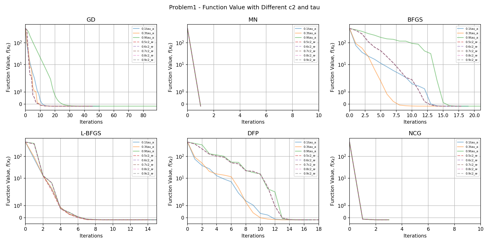
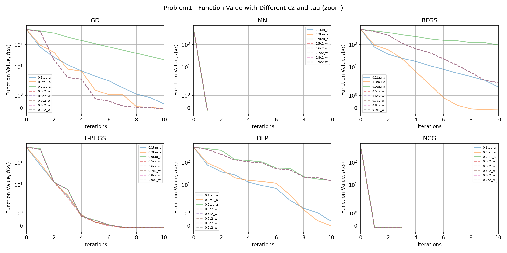


### Problem 2

<!-- BEGIN_Problem2_TABLE -->
|          |   Iters |        Time | Convergence                                  |   Func Evals |   Grad Evals |   Hess Evals |
|:---------|--------:|------------:|:---------------------------------------------|-------------:|-------------:|-------------:|
| GD-a     |     999 | 0.779818    | Failed. Maximum iterations reached.          |        60998 |         2000 |            0 |
| GD-w     |     999 | 0.141348    | Failed. Maximum iterations reached.          |        10965 |         1000 |            0 |
| MN-a     |       1 | 0.000758171 | Converged. Gradient norm is below tolerance. |            3 |            4 |            2 |
| MN-w     |       1 | 0.000251293 | Converged. Gradient norm is below tolerance. |            3 |            3 |            2 |
| BFGS-a   |      13 | 0.0168781   | Converged. Gradient norm is below tolerance. |          489 |           41 |            0 |
| BFGS-w   |      12 | 0.00294685  | Converged. Gradient norm is below tolerance. |          100 |           26 |            0 |
| L-BFGS-a |      26 | 0.0527518   | Converged. Gradient norm is below tolerance. |          114 |           79 |            0 |
| L-BFGS-w |      27 | 0.00665283  | Converged. Gradient norm is below tolerance. |           67 |           55 |            0 |
| DFP-a    |      14 | 0.0139461   | Converged. Gradient norm is below tolerance. |          321 |           44 |            0 |
| DFP-w    |      13 | 0.00240779  | Converged. Gradient norm is below tolerance. |           81 |           28 |            0 |
| NCG-a    |       2 | 0.000983953 | Converged. Gradient norm is below tolerance. |            5 |            6 |            3 |
| NCG-w    |       2 | 0.000833035 | Converged. Gradient norm is below tolerance. |            5 |            4 |            3 |
<!-- END_Problem2_TABLE -->


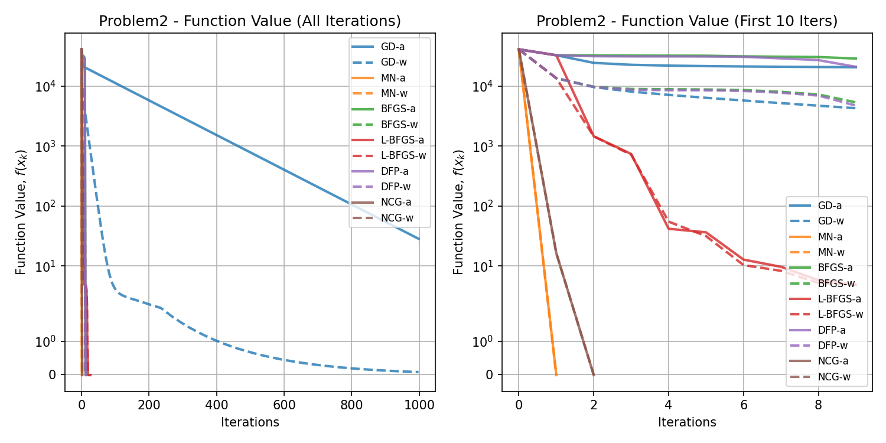
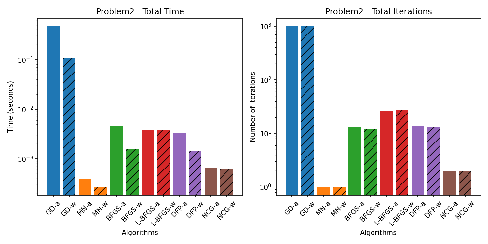


### Problem 3

<!-- BEGIN_Problem3_TABLE -->
|          |   Iters |      Time | Convergence                                  |   Func Evals |   Grad Evals |   Hess Evals |
|:---------|--------:|----------:|:---------------------------------------------|-------------:|-------------:|-------------:|
| GD-a     |      88 |  1.45482  | Converged. Gradient norm is below tolerance. |         1574 |          177 |            0 |
| GD-w     |      41 |  0.225788 | Converged. Gradient norm is below tolerance. |          180 |           42 |            0 |
| MN-a     |       1 |  2.17041  | Converged. Gradient norm is below tolerance. |            3 |            4 |            2 |
| MN-w     |       1 |  3.20355  | Converged. Gradient norm is below tolerance. |            3 |            3 |            2 |
| BFGS-a   |     227 | 24.7865   | Converged. Gradient norm is below tolerance. |         1361 |          683 |            0 |
| BFGS-w   |      59 |  6.07561  | Converged. Gradient norm is below tolerance. |          179 |          120 |            0 |
| L-BFGS-a |      21 |  0.224546 | Converged. Gradient norm is below tolerance. |           59 |           64 |            0 |
| L-BFGS-w |      21 |  0.1726   | Converged. Gradient norm is below tolerance. |           46 |           43 |            0 |
| DFP-a    |     104 | 10.8141   | Converged. Gradient norm is below tolerance. |          229 |          314 |            0 |
| DFP-w    |      29 |  2.76775  | Converged. Gradient norm is below tolerance. |           88 |           60 |            0 |
| NCG-a    |       3 |  0.155826 | Converged. Gradient norm is below tolerance. |            7 |            8 |            4 |
| NCG-w    |       3 |  0.123033 | Converged. Gradient norm is below tolerance. |            7 |            5 |            4 |
<!-- END_Problem3_TABLE -->


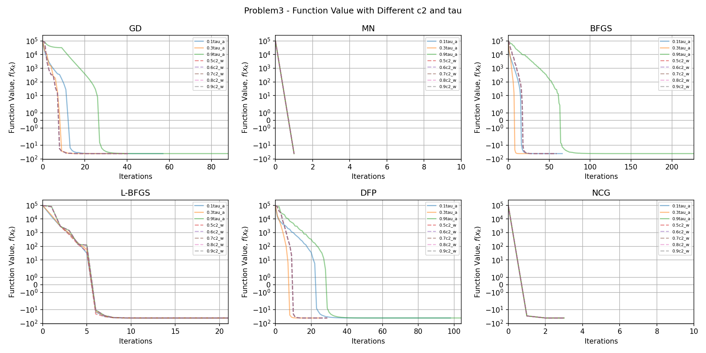


### Problem 4

<!-- BEGIN_Problem4_TABLE -->
|          |   Iters |       Time | Convergence                                  |   Func Evals |   Grad Evals |   Hess Evals |
|:---------|--------:|-----------:|:---------------------------------------------|-------------:|-------------:|-------------:|
| GD-a     |     999 |  46.2187   | Failed. Maximum iterations reached.          |        60997 |         2000 |            0 |
| GD-w     |     999 |   8.12913  | Failed. Maximum iterations reached.          |        10965 |         1000 |            0 |
| MN-a     |       1 |   1.62034  | Converged. Gradient norm is below tolerance. |            3 |            4 |            2 |
| MN-w     |       1 |   1.39753  | Converged. Gradient norm is below tolerance. |            3 |            3 |            2 |
| BFGS-a   |     999 | 114.43     | Failed. Maximum iterations reached.          |        47132 |         3001 |            0 |
| BFGS-w   |     508 |  43.7413   | Converged. Gradient norm is below tolerance. |         4779 |         1018 |            0 |
| L-BFGS-a |     123 |   0.564661 | Converged. Gradient norm is below tolerance. |          316 |          370 |            0 |
| L-BFGS-w |     126 |   0.850478 | Converged. Gradient norm is below tolerance. |          267 |          253 |            0 |
| DFP-a    |     857 |  73.4942   | Converged. Gradient norm is below tolerance. |        19277 |         2573 |            0 |
| DFP-w    |     288 |  28.1956   | Converged. Gradient norm is below tolerance. |         1750 |          578 |            0 |
| NCG-a    |       3 |   0.646501 | Converged. Gradient norm is below tolerance. |            7 |            8 |            4 |
| NCG-w    |       3 |   0.579264 | Converged. Gradient norm is below tolerance. |            7 |            5 |            4 |
<!-- END_Problem4_TABLE -->


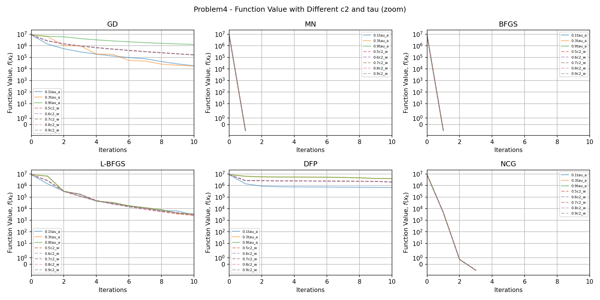

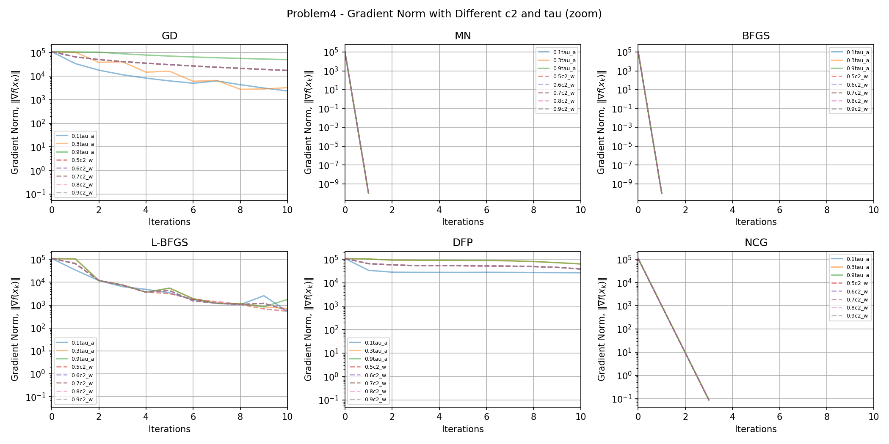

### Problem 5

<!-- BEGIN_Problem5_TABLE -->
|          |   Iters |        Time | Convergence                                  |   Func Evals |   Grad Evals |   Hess Evals |
|:---------|--------:|------------:|:---------------------------------------------|-------------:|-------------:|-------------:|
| GD-a     |       2 | 0.000516891 | Converged. Gradient norm is below tolerance. |            5 |            5 |            0 |
| GD-w     |       2 | 0.000232935 | Converged. Gradient norm is below tolerance. |            5 |            3 |            0 |
| MN-a     |       2 | 0.000506878 | Converged. Gradient norm is below tolerance. |            5 |            6 |            3 |
| MN-w     |       2 | 0.000432968 | Converged. Gradient norm is below tolerance. |            5 |            4 |            3 |
| BFGS-a   |       3 | 0.000290871 | Converged. Gradient norm is below tolerance. |            7 |           11 |            0 |
| BFGS-w   |       3 | 0.000291824 | Converged. Gradient norm is below tolerance. |            7 |            8 |            0 |
| L-BFGS-a |       3 | 0.000273705 | Converged. Gradient norm is below tolerance. |            7 |           10 |            0 |
| L-BFGS-w |       3 | 0.000304937 | Converged. Gradient norm is below tolerance. |            7 |            7 |            0 |
| DFP-a    |       3 | 0.000249863 | Converged. Gradient norm is below tolerance. |            7 |           11 |            0 |
| DFP-w    |       3 | 0.000270844 | Converged. Gradient norm is below tolerance. |            7 |            8 |            0 |
| NCG-a    |       2 | 0.000214577 | Converged. Gradient norm is below tolerance. |            5 |            6 |            3 |
| NCG-w    |       2 | 0.000221968 | Converged. Gradient norm is below tolerance. |            5 |            4 |            3 |
<!-- END_Problem5_TABLE -->


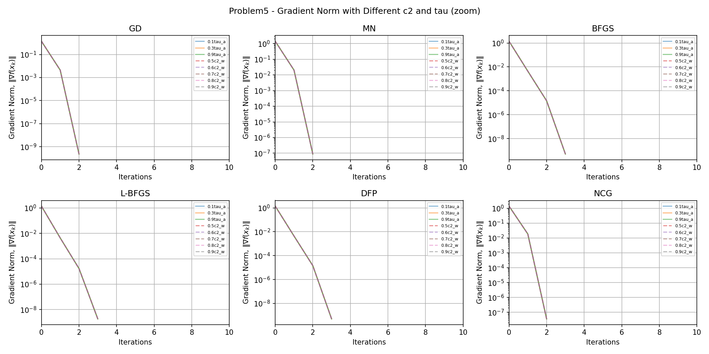

### Problem 6

<!-- BEGIN_Problem6_TABLE -->
|          |   Iters |        Time | Convergence                                  |   Func Evals |   Grad Evals |   Hess Evals |
|:---------|--------:|------------:|:---------------------------------------------|-------------:|-------------:|-------------:|
| GD-a     |      42 | 0.021486    | Converged. Gradient norm is below tolerance. |         3167 |           85 |            0 |
| GD-w     |       6 | 0.000741959 | Converged. Gradient norm is below tolerance. |           94 |            7 |            0 |
| MN-a     |      31 | 0.00917602  | Converged. Gradient norm is below tolerance. |           63 |           64 |           32 |
| MN-w     |      31 | 0.00824499  | Converged. Gradient norm is below tolerance. |           63 |           33 |           32 |
| BFGS-a   |      12 | 0.00365806  | Converged. Gradient norm is below tolerance. |          458 |           38 |            0 |
| BFGS-w   |      24 | 0.00236273  | Converged. Gradient norm is below tolerance. |          111 |           50 |            0 |
| L-BFGS-a |      14 | 0.00208092  | Converged. Gradient norm is below tolerance. |          145 |           43 |            0 |
| L-BFGS-w |      15 | 0.00170803  | Converged. Gradient norm is below tolerance. |           49 |           31 |            0 |
| DFP-a    |      14 | 0.00365424  | Converged. Gradient norm is below tolerance. |          451 |           44 |            0 |
| DFP-w    |      65 | 0.00540709  | Converged. Gradient norm is below tolerance. |          192 |          132 |            0 |
| NCG-a    |     999 | 2.69485     | Failed. Maximum iterations reached.          |       363679 |         2001 |         1000 |
| NCG-w    |     999 | 0.642192    | Failed. Maximum iterations reached.          |        63186 |         1001 |         1000 |
<!-- END_Problem6_TABLE -->


### Problem 7

<!-- BEGIN_Problem7_TABLE -->
|          |   Iters |       Time | Convergence                                  |   Func Evals |   Grad Evals |   Hess Evals |
|:---------|--------:|-----------:|:---------------------------------------------|-------------:|-------------:|-------------:|
| GD-a     |     999 | 0.439352   | Failed. Maximum iterations reached.          |        66070 |         2000 |            0 |
| GD-w     |     999 | 0.059684   | Failed. Maximum iterations reached.          |        10881 |         1001 |            0 |
| MN-a     |      19 | 0.00163984 | Converged. Gradient norm is below tolerance. |           95 |           40 |           20 |
| MN-w     |      20 | 0.00144196 | Converged. Gradient norm is below tolerance. |           48 |           22 |           21 |
| BFGS-a   |      18 | 0.00188184 | Converged. Gradient norm is below tolerance. |          143 |           56 |            0 |
| BFGS-w   |      33 | 0.00263619 | Converged. Gradient norm is below tolerance. |           86 |           68 |            0 |
| L-BFGS-a |      23 | 0.00226784 | Converged. Gradient norm is below tolerance. |          129 |           70 |            0 |
| L-BFGS-w |      37 | 0.00263095 | Converged. Gradient norm is below tolerance. |           95 |           83 |            0 |
| DFP-a    |     249 | 0.0147309  | Converged. Gradient norm is below tolerance. |          608 |          749 |            0 |
| DFP-w    |      35 | 0.00240302 | Converged. Gradient norm is below tolerance. |           88 |           76 |            0 |
| NCG-a    |      19 | 0.00144577 | Converged. Gradient norm is below tolerance. |           95 |           40 |           20 |
| NCG-w    |      20 | 0.00144792 | Converged. Gradient norm is below tolerance. |           48 |           22 |           21 |
<!-- END_Problem7_TABLE -->


### Problem 8

<!-- BEGIN_Problem8_TABLE -->
|          |   Iters |      Time | Convergence                                  |   Func Evals |   Grad Evals |   Hess Evals |
|:---------|--------:|----------:|:---------------------------------------------|-------------:|-------------:|-------------:|
| GD-a     |     132 | 0.126904  | Converged. Gradient norm is below tolerance. |         8832 |          265 |            0 |
| GD-w     |      45 | 0.0208046 | Converged. Gradient norm is below tolerance. |          540 |           46 |            0 |
| MN-a     |      74 | 0.530506  | Converged. Gradient norm is below tolerance. |          149 |          150 |           75 |
| MN-w     |      74 | 0.480218  | Converged. Gradient norm is below tolerance. |          149 |           76 |           75 |
| BFGS-a   |     119 | 0.346294  | Converged. Gradient norm is below tolerance. |         5847 |          359 |            0 |
| BFGS-w   |     112 | 0.226675  | Converged. Gradient norm is below tolerance. |         1124 |          226 |            0 |
| L-BFGS-a |      21 | 0.0188441 | Converged. Gradient norm is below tolerance. |          112 |           64 |            0 |
| L-BFGS-w |      20 | 0.020107  | Converged. Gradient norm is below tolerance. |           53 |           41 |            0 |
| DFP-a    |     117 | 0.239935  | Converged. Gradient norm is below tolerance. |         2889 |          353 |            0 |
| DFP-w    |     110 | 0.331541  | Converged. Gradient norm is below tolerance. |          730 |          222 |            0 |
| NCG-a    |      76 | 0.127342  | Converged. Gradient norm is below tolerance. |          153 |          154 |           77 |
| NCG-w    |      76 | 0.180766  | Converged. Gradient norm is below tolerance. |          153 |           78 |           77 |
<!-- END_Problem8_TABLE -->


### Problem 9

<!-- BEGIN_Problem9_TABLE -->
|          |   Iters |        Time | Convergence                                  |   Func Evals |   Grad Evals |   Hess Evals |
|:---------|--------:|------------:|:---------------------------------------------|-------------:|-------------:|-------------:|
| GD-a     |     770 | 0.144329    | Converged. Gradient norm is below tolerance. |        24495 |         1541 |            0 |
| GD-w     |     543 | 0.0410669   | Converged. Gradient norm is below tolerance. |         3523 |          544 |            0 |
| MN-a     |     116 | 0.0129631   | Converged. Gradient norm is below tolerance. |          985 |          234 |          117 |
| MN-w     |       7 | 0.000818968 | Converged. Gradient norm is below tolerance. |           55 |            9 |            8 |
| BFGS-a   |      17 | 0.00210524  | Converged. Gradient norm is below tolerance. |           84 |           53 |            0 |
| BFGS-w   |      14 | 0.00118804  | Converged. Gradient norm is below tolerance. |           37 |           30 |            0 |
| L-BFGS-a |      17 | 0.0013566   | Converged. Gradient norm is below tolerance. |           67 |           52 |            0 |
| L-BFGS-w |      16 | 0.00134182  | Converged. Gradient norm is below tolerance. |           44 |           33 |            0 |
| DFP-a    |      21 | 0.00171709  | Converged. Gradient norm is below tolerance. |           93 |           65 |            0 |
| DFP-w    |      21 | 0.00162506  | Converged. Gradient norm is below tolerance. |           51 |           44 |            0 |
| NCG-a    |      10 | 0.000897169 | Converged. Gradient norm is below tolerance. |           39 |           22 |           11 |
| NCG-w    |       7 | 0.000700235 | Converged. Gradient norm is below tolerance. |           17 |            9 |            8 |
<!-- END_Problem9_TABLE -->


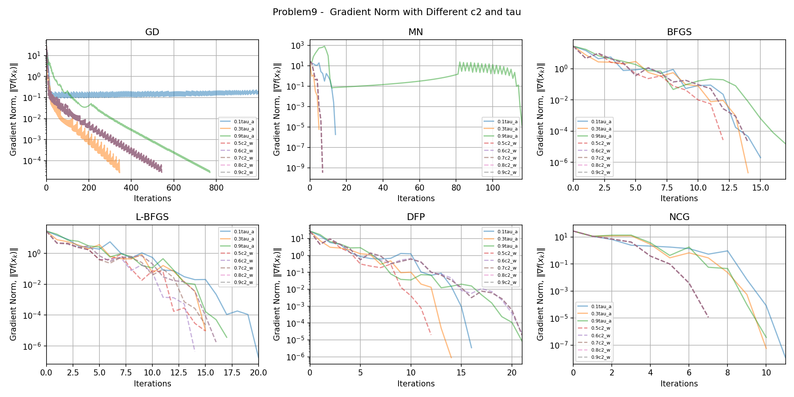


### Problem 10

<!-- BEGIN_Problem10_TABLE -->
|          |   Iters |       Time | Convergence                                  |   Func Evals |   Grad Evals |   Hess Evals |
|:---------|--------:|-----------:|:---------------------------------------------|-------------:|-------------:|-------------:|
| GD-a     |     999 | 0.066062   | Failed. Maximum iterations reached.          |         2019 |         2000 |            0 |
| GD-w     |      26 | 0.00228596 | Converged. Gradient norm is below tolerance. |           67 |           27 |            0 |
| MN-a     |      13 | 0.00555706 | Converged. Gradient norm is below tolerance. |           93 |           28 |           14 |
| MN-w     |      13 | 0.003438   | Converged. Gradient norm is below tolerance. |           37 |           15 |           14 |
| BFGS-a   |      23 | 0.00539494 | Converged. Gradient norm is below tolerance. |           59 |           71 |            0 |
| BFGS-w   |      19 | 0.00446296 | Converged. Gradient norm is below tolerance. |           42 |           41 |            0 |
| L-BFGS-a |      21 | 0.0112078  | Converged. Gradient norm is below tolerance. |          784 |           64 |            0 |
| L-BFGS-w |       7 | 0.00240707 | Converged. Gradient norm is below tolerance. |           18 |           19 |            0 |
| DFP-a    |      48 | 0.0108521  | Converged. Gradient norm is below tolerance. |          137 |          146 |            0 |
| DFP-w    |     104 | 0.0231512  | Converged. Gradient norm is below tolerance. |          215 |          222 |            0 |
| NCG-a    |      12 | 0.00155807 | Converged. Gradient norm is below tolerance. |           25 |           26 |           13 |
| NCG-w    |      12 | 0.00155401 | Converged. Gradient norm is below tolerance. |           25 |           14 |           13 |
<!-- END_Problem10_TABLE -->


### Problem 11

<!-- BEGIN_Problem11_TABLE -->
|          |   Iters |      Time | Convergence                                  |   Func Evals |   Grad Evals |   Hess Evals |
|:---------|--------:|----------:|:---------------------------------------------|-------------:|-------------:|-------------:|
| GD-a     |     999 | 0.739482  | Failed. Maximum iterations reached.          |         2019 |         2000 |            0 |
| GD-w     |      13 | 0.0143642 | Converged. Gradient norm is below tolerance. |           29 |           16 |            0 |
| MN-a     |      13 | 0.722772  | Converged. Gradient norm is below tolerance. |           91 |           28 |           14 |
| MN-w     |      13 | 0.935033  | Converged. Gradient norm is below tolerance. |           37 |           15 |           14 |
| BFGS-a   |      21 | 1.87135   | Converged. Gradient norm is below tolerance. |           55 |           65 |            0 |
| BFGS-w   |       5 | 0.418559  | Converged. Gradient norm is below tolerance. |           16 |           14 |            0 |
| L-BFGS-a |      20 | 0.141473  | Converged. Gradient norm is below tolerance. |          786 |           61 |            0 |
| L-BFGS-w |       5 | 0.0334108 | Converged. Gradient norm is below tolerance. |           16 |           15 |            0 |
| DFP-a    |      50 | 5.05462   | Converged. Gradient norm is below tolerance. |          120 |          152 |            0 |
| DFP-w    |       5 | 0.389942  | Converged. Gradient norm is below tolerance. |           16 |           14 |            0 |
| NCG-a    |      12 | 0.134539  | Converged. Gradient norm is below tolerance. |           25 |           26 |           13 |
| NCG-w    |      12 | 0.116514  | Converged. Gradient norm is below tolerance. |           25 |           14 |           13 |
<!-- END_Problem11_TABLE -->


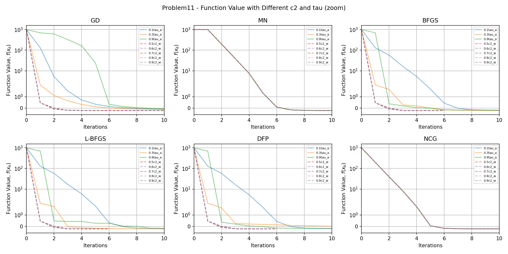

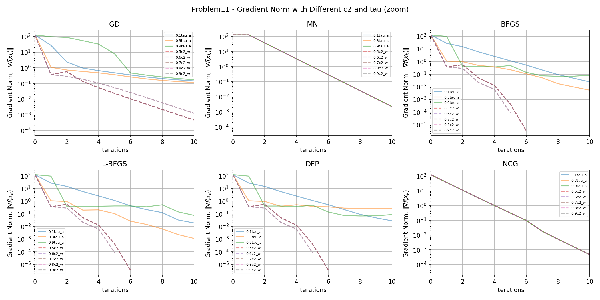

### Problem 12

<!-- BEGIN_Problem12_TABLE -->
|          |   Iters |       Time | Convergence                                  |   Func Evals |   Grad Evals |   Hess Evals |
|:---------|--------:|-----------:|:---------------------------------------------|-------------:|-------------:|-------------:|
| GD-a     |     173 | 0.0348411  | Converged. Gradient norm is below tolerance. |         1226 |          347 |            0 |
| GD-w     |     193 | 0.0345438  | Converged. Gradient norm is below tolerance. |          696 |          207 |            0 |
| MN-a     |     223 | 0.219475   | Converged. Gradient norm is below tolerance. |        14310 |          448 |          224 |
| MN-w     |     102 | 0.0325351  | Converged. Gradient norm is below tolerance. |         1152 |          105 |          103 |
| BFGS-a   |      91 | 0.0197861  | Converged. Gradient norm is below tolerance. |          463 |          275 |            0 |
| BFGS-w   |      41 | 0.0104251  | Converged. Gradient norm is below tolerance. |           97 |           86 |            0 |
| L-BFGS-a |      36 | 0.010047   | Converged. Gradient norm is below tolerance. |          203 |          109 |            0 |
| L-BFGS-w |      27 | 0.00716019 | Converged. Gradient norm is below tolerance. |           65 |           55 |            0 |
| DFP-a    |     999 | 0.328016   | Failed. Maximum iterations reached.          |         2138 |         3001 |            0 |
| DFP-w    |     999 | 0.268516   | Failed. Maximum iterations reached.          |         2024 |         2061 |            0 |
| NCG-a    |      46 | 0.00760508 | Converged. Gradient norm is below tolerance. |          113 |           94 |           47 |
| NCG-w    |      44 | 0.0094347  | Converged. Gradient norm is below tolerance. |          111 |           64 |           45 |
<!-- END_Problem12_TABLE -->

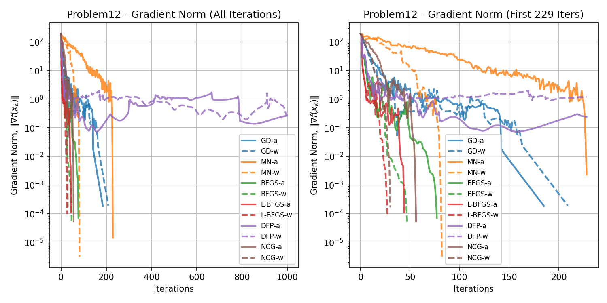


