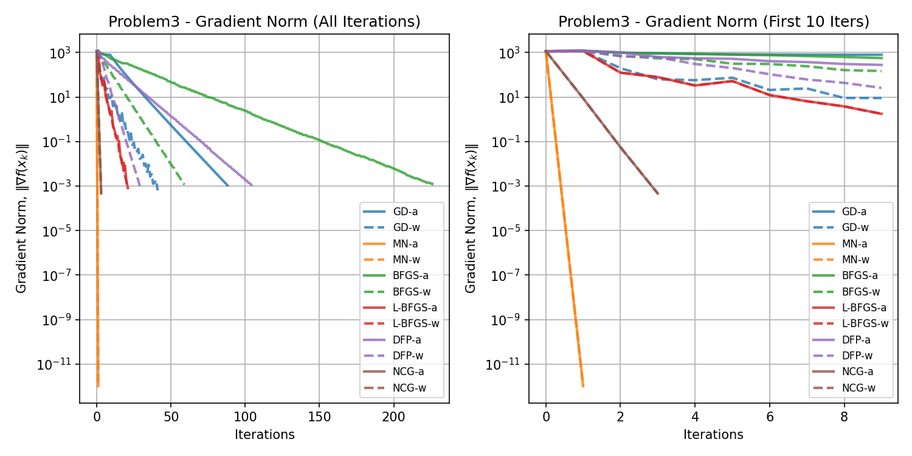
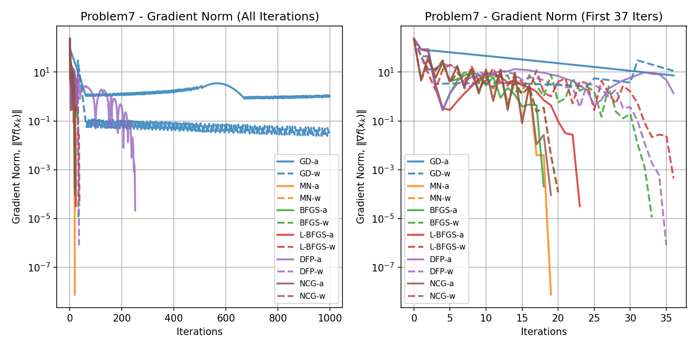
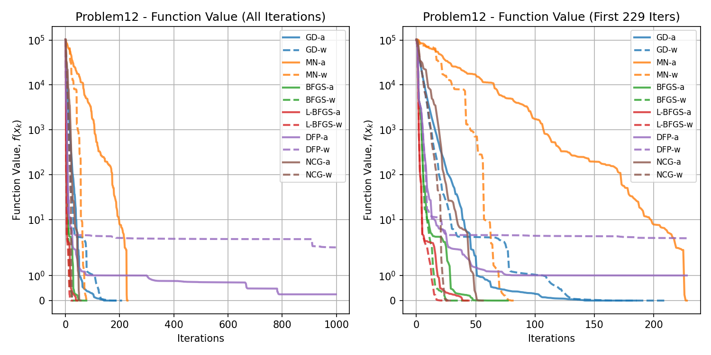

# Algorithms for Non-Linear Programming

## This repository contains implementations of various algorithms for solving non-linear programming problems.


### How to Use:

Run the specific problem script, for example:
```bash
python problem1.py
```

or run the main script to execute all problems:
```bash
python run_all_problems.py
```

## Results

Plots for each problem will be saved in the `figures` directory. Data for each problem will be saved in the `data` directory.

### Problem 1

% import the data from data/Problem1.csv as a table in markdown:


### Problem 2


### Problem 3



### Problem 4


### Problem 5


### Problem 6


### Problem 7



### Problem 8


### Problem 9


### Problem 10


### Problem 11


### Problem 12



