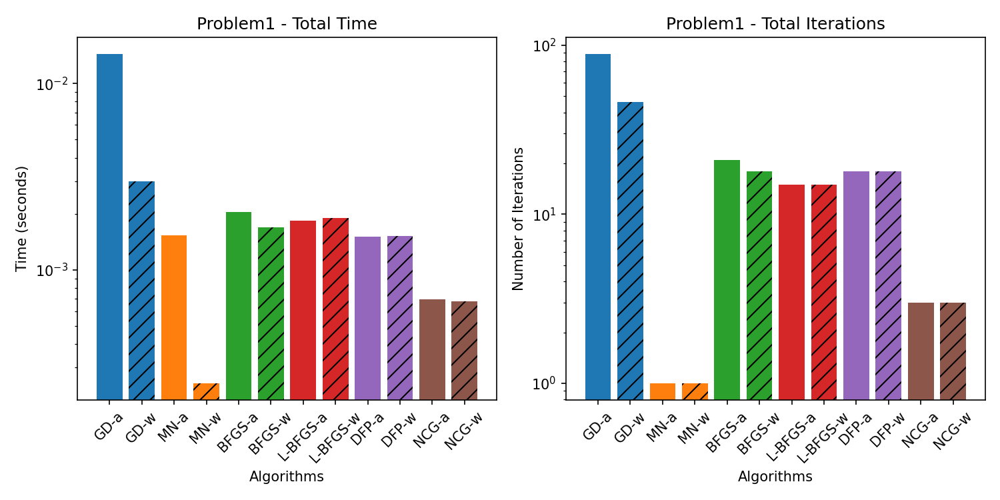
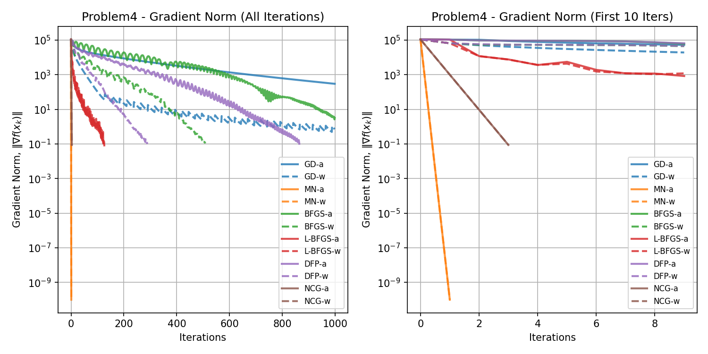
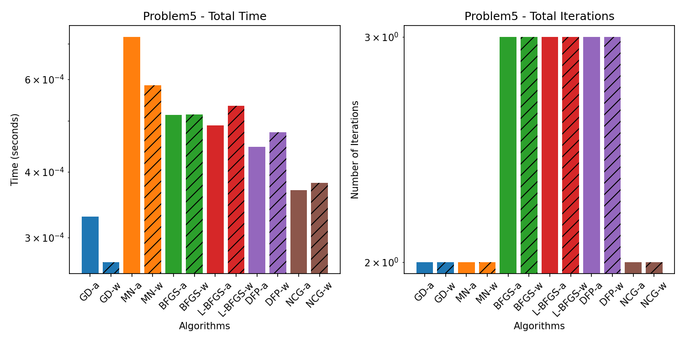
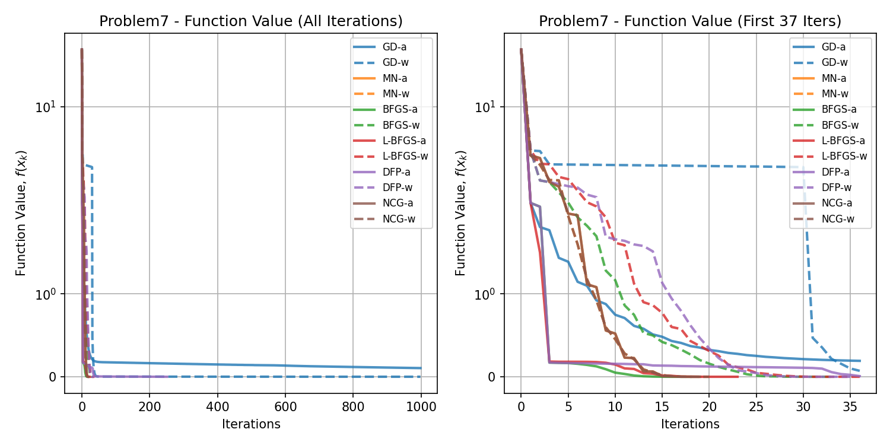
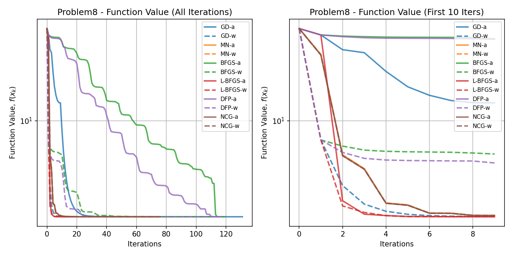

# Algorithms for Non-Linear Programming

## This repository contains implementations of various algorithms for solving non-linear programming problems.

### Getting Started

Install Python 3.10
```bash
sudo apt-get install python3.10-full
```

Install Venv Package
```bash
sudo apt-get install python3-venv
```

Create a virtual environment
```bash
python3.10 -m venv env
```

Activate the virtual environment
```bash
source env/bin/activate
```

Install the required packages
```bash
pip install -r requirements.txt
```

### How to Use

Run the specific problem script, for example:
```bash
python problem1.py
```

or run the main script to execute all problems:
```bash
python run_all_problems.py
```

## Results

Plots for each problem will be saved in the `figures` directory. Data for each problem will be saved in the `data` directory.

### Problem 1

<!-- BEGIN_PROBLEM_1_TABLE -->
|          |   Iters |        Time | Convergence                                  |   Func Evals |   Grad Evals |   Hess Evals |
|:---------|--------:|------------:|:---------------------------------------------|-------------:|-------------:|-------------:|
| GD-a     |      49 | 0.00627708  | Converged. Gradient norm is below tolerance. |          190 |           99 |            0 |
| GD-w     |      46 | 0.00667191  | Converged. Gradient norm is below tolerance. |          202 |           47 |            0 |
| MN-a     |       1 | 0.000771761 | Converged. Gradient norm is below tolerance. |            3 |            4 |            2 |
| MN-w     |       1 | 0.000727892 | Converged. Gradient norm is below tolerance. |            3 |            3 |            2 |
| BFGS-a   |      15 | 0.00304484  | Converged. Gradient norm is below tolerance. |           44 |           47 |            0 |
| BFGS-w   |      18 | 0.00391817  | Converged. Gradient norm is below tolerance. |           49 |           38 |            0 |
| L-BFGS-a |      14 | 0.00389934  | Converged. Gradient norm is below tolerance. |           32 |           43 |            0 |
| L-BFGS-w |      15 | 0.00442886  | Converged. Gradient norm is below tolerance. |           33 |           31 |            0 |
| DFP-a    |      13 | 0.00260139  | Converged. Gradient norm is below tolerance. |           40 |           41 |            0 |
| DFP-w    |      18 | 0.00356841  | Converged. Gradient norm is below tolerance. |           41 |           38 |            0 |
| NCG-a    |       3 | 0.00164366  | Converged. Gradient norm is below tolerance. |            7 |            8 |            4 |
| NCG-w    |       3 | 0.00169659  | Converged. Gradient norm is below tolerance. |            7 |            5 |            4 |<!-- END_PROBLEM_1_TABLE -->





### Problem 2

<!-- BEGIN_PROBLEM_2_TABLE -->
|          |   Iters |        Time | Convergence                                  |   Func Evals |   Grad Evals |   Hess Evals |
|:---------|--------:|------------:|:---------------------------------------------|-------------:|-------------:|-------------:|
| GD-a     |     999 | 0.225948    | Failed. Maximum iterations reached.          |         8722 |         2000 |            0 |
| GD-w     |     999 | 0.238851    | Failed. Maximum iterations reached.          |        10965 |         1000 |            0 |
| MN-a     |       1 | 0.000850439 | Converged. Gradient norm is below tolerance. |            3 |            4 |            2 |
| MN-w     |       1 | 0.000647545 | Converged. Gradient norm is below tolerance. |            3 |            3 |            2 |
| BFGS-a   |      12 | 0.00360751  | Converged. Gradient norm is below tolerance. |           81 |           38 |            0 |
| BFGS-w   |      12 | 0.00393152  | Converged. Gradient norm is below tolerance. |          100 |           26 |            0 |
| L-BFGS-a |      24 | 0.0086751   | Converged. Gradient norm is below tolerance. |           56 |           73 |            0 |
| L-BFGS-w |      27 | 0.00937366  | Converged. Gradient norm is below tolerance. |           67 |           55 |            0 |
| DFP-a    |      12 | 0.00339293  | Converged. Gradient norm is below tolerance. |           71 |           38 |            0 |
| DFP-w    |      13 | 0.00374603  | Converged. Gradient norm is below tolerance. |           81 |           28 |            0 |
| NCG-a    |       2 | 0.00157499  | Converged. Gradient norm is below tolerance. |            5 |            6 |            3 |
| NCG-w    |       2 | 0.00161791  | Converged. Gradient norm is below tolerance. |            5 |            4 |            3 |<!-- END_PROBLEM_2_TABLE -->


### Problem 3

<!-- BEGIN_PROBLEM_3_TABLE -->
|          |   Iters |     Time | Convergence                                  |   Func Evals |   Grad Evals |   Hess Evals |
|:---------|--------:|---------:|:---------------------------------------------|-------------:|-------------:|-------------:|
| GD-a     |      46 | 0.149904 | Converged. Gradient norm is below tolerance. |          178 |           93 |            0 |
| GD-w     |      41 | 0.159244 | Converged. Gradient norm is below tolerance. |          180 |           42 |            0 |
| MN-a     |       1 | 2.87684  | Converged. Gradient norm is below tolerance. |            3 |            4 |            2 |
| MN-w     |       1 | 2.54326  | Converged. Gradient norm is below tolerance. |            3 |            3 |            2 |
| BFGS-a   |      36 | 2.36012  | Converged. Gradient norm is below tolerance. |          111 |          110 |            0 |
| BFGS-w   |      59 | 4.97915  | Converged. Gradient norm is below tolerance. |          179 |          120 |            0 |
| L-BFGS-a |      23 | 0.164352 | Converged. Gradient norm is below tolerance. |           51 |           70 |            0 |
| L-BFGS-w |      21 | 0.137408 | Converged. Gradient norm is below tolerance. |           46 |           43 |            0 |
| DFP-a    |      24 | 1.62924  | Converged. Gradient norm is below tolerance. |           74 |           74 |            0 |
| DFP-w    |      29 | 1.9033   | Converged. Gradient norm is below tolerance. |           88 |           60 |            0 |
| NCG-a    |       3 | 0.284889 | Converged. Gradient norm is below tolerance. |            7 |            8 |            4 |
| NCG-w    |       3 | 0.129295 | Converged. Gradient norm is below tolerance. |            7 |            5 |            4 |<!-- END_PROBLEM_3_TABLE -->


### Problem 4

<!-- BEGIN_PROBLEM_4_TABLE -->
|          |   Iters |      Time | Convergence                                  |   Func Evals |   Grad Evals |   Hess Evals |
|:---------|--------:|----------:|:---------------------------------------------|-------------:|-------------:|-------------:|
| GD-a     |     999 |  5.64754  | Failed. Maximum iterations reached.          |         8722 |         2000 |            0 |
| GD-w     |     999 |  8.46339  | Failed. Maximum iterations reached.          |        10965 |         1000 |            0 |
| MN-a     |       1 |  3.11792  | Converged. Gradient norm is below tolerance. |            3 |            4 |            2 |
| MN-w     |       1 |  2.79129  | Converged. Gradient norm is below tolerance. |            3 |            3 |            2 |
| BFGS-a   |     181 | 22.8544   | Converged. Gradient norm is below tolerance. |         1451 |          545 |            0 |
| BFGS-w   |     508 | 39.9129   | Converged. Gradient norm is below tolerance. |         4779 |         1018 |            0 |
| L-BFGS-a |     127 |  1.54507  | Converged. Gradient norm is below tolerance. |          267 |          382 |            0 |
| L-BFGS-w |     126 |  0.781778 | Converged. Gradient norm is below tolerance. |          267 |          253 |            0 |
| DFP-a    |     240 | 15.2997   | Converged. Gradient norm is below tolerance. |         1268 |          722 |            0 |
| DFP-w    |     288 | 17.783    | Converged. Gradient norm is below tolerance. |         1750 |          578 |            0 |
| NCG-a    |       3 |  0.533978 | Converged. Gradient norm is below tolerance. |            7 |            8 |            4 |
| NCG-w    |       3 |  0.468502 | Converged. Gradient norm is below tolerance. |            7 |            5 |            4 |<!-- END_PROBLEM_4_TABLE -->




### Problem 5

<!-- BEGIN_PROBLEM_5_TABLE -->
|          |   Iters |        Time | Convergence                                  |   Func Evals |   Grad Evals |   Hess Evals |
|:---------|--------:|------------:|:---------------------------------------------|-------------:|-------------:|-------------:|
| GD-a     |       3 | 0.000770092 | Converged. Gradient norm is below tolerance. |            7 |            7 |            0 |
| GD-w     |       3 | 0.000644922 | Converged. Gradient norm is below tolerance. |            7 |            4 |            0 |
| MN-a     |       3 | 0.0023911   | Converged. Gradient norm is below tolerance. |            7 |            8 |            4 |
| MN-w     |       3 | 0.00140238  | Converged. Gradient norm is below tolerance. |            7 |            5 |            4 |
| BFGS-a   |       3 | 0.000858784 | Converged. Gradient norm is below tolerance. |            7 |           11 |            0 |
| BFGS-w   |       3 | 0.00101233  | Converged. Gradient norm is below tolerance. |            7 |            8 |            0 |
| L-BFGS-a |       4 | 0.00116229  | Converged. Gradient norm is below tolerance. |            9 |           13 |            0 |
| L-BFGS-w |       4 | 0.00128317  | Converged. Gradient norm is below tolerance. |            9 |            9 |            0 |
| DFP-a    |       3 | 0.000855923 | Converged. Gradient norm is below tolerance. |            7 |           11 |            0 |
| DFP-w    |       3 | 0.000930071 | Converged. Gradient norm is below tolerance. |            7 |            8 |            0 |
| NCG-a    |       3 | 0.000947952 | Converged. Gradient norm is below tolerance. |            7 |            8 |            4 |
| NCG-w    |       3 | 0.00102019  | Converged. Gradient norm is below tolerance. |            7 |            5 |            4 |<!-- END_PROBLEM_5_TABLE -->




### Problem 6

<!-- BEGIN_PROBLEM_6_TABLE -->
|          |   Iters |       Time | Convergence                                  |   Func Evals |   Grad Evals |   Hess Evals |
|:---------|--------:|-----------:|:---------------------------------------------|-------------:|-------------:|-------------:|
| GD-a     |       8 | 0.00267839 | Converged. Gradient norm is below tolerance. |          102 |           17 |            0 |
| GD-w     |       7 | 0.00273061 | Converged. Gradient norm is below tolerance. |          132 |            8 |            0 |
| MN-a     |      31 | 0.0324914  | Converged. Gradient norm is below tolerance. |           63 |           64 |           32 |
| MN-w     |      31 | 0.0327451  | Converged. Gradient norm is below tolerance. |           63 |           33 |           32 |
| BFGS-a   |      26 | 0.00672174 | Converged. Gradient norm is below tolerance. |          113 |           80 |            0 |
| BFGS-w   |      24 | 0.00698209 | Converged. Gradient norm is below tolerance. |          129 |           50 |            0 |
| L-BFGS-a |      15 | 0.00412393 | Converged. Gradient norm is below tolerance. |           47 |           46 |            0 |
| L-BFGS-w |      14 | 0.00403428 | Converged. Gradient norm is below tolerance. |           50 |           29 |            0 |
| DFP-a    |     142 | 0.028933   | Converged. Gradient norm is below tolerance. |          344 |          428 |            0 |
| DFP-w    |     393 | 0.0922611  | Converged. Gradient norm is below tolerance. |          867 |          788 |            0 |
| NCG-a    |      57 | 0.0401502  | Converged. Gradient norm is below tolerance. |          611 |          116 |           58 |
| NCG-w    |      59 | 0.0449107  | Converged. Gradient norm is below tolerance. |          898 |           61 |           60 |<!-- END_PROBLEM_6_TABLE -->


### Problem 7

<!-- BEGIN_PROBLEM_7_TABLE -->
|          |   Iters |       Time | Convergence                                  |   Func Evals |   Grad Evals |   Hess Evals |
|:---------|--------:|-----------:|:---------------------------------------------|-------------:|-------------:|-------------:|
| GD-a     |     999 | 0.144972   | Failed. Maximum iterations reached.          |         8923 |         2000 |            0 |
| GD-w     |     999 | 0.16291    | Failed. Maximum iterations reached.          |        10881 |         1001 |            0 |
| MN-a     |      20 | 0.0048604  | Converged. Gradient norm is below tolerance. |           47 |           42 |           21 |
| MN-w     |      20 | 0.00508499 | Converged. Gradient norm is below tolerance. |           48 |           22 |           21 |
| BFGS-a   |      35 | 0.00653625 | Converged. Gradient norm is below tolerance. |           90 |          107 |            0 |
| BFGS-w   |      33 | 0.0062995  | Converged. Gradient norm is below tolerance. |           86 |           68 |            0 |
| L-BFGS-a |      39 | 0.00668573 | Converged. Gradient norm is below tolerance. |          108 |          118 |            0 |
| L-BFGS-w |      37 | 0.0077796  | Converged. Gradient norm is below tolerance. |           95 |           83 |            0 |
| DFP-a    |     999 | 0.170804   | Failed. Maximum iterations reached.          |         2031 |         3001 |            0 |
| DFP-w    |      35 | 0.00734663 | Converged. Gradient norm is below tolerance. |           88 |           76 |            0 |
| NCG-a    |      21 | 0.00394392 | Converged. Gradient norm is below tolerance. |           49 |           44 |           22 |
| NCG-w    |      20 | 0.00429821 | Converged. Gradient norm is below tolerance. |           48 |           22 |           21 |<!-- END_PROBLEM_7_TABLE -->





### Problem 8

<!-- BEGIN_PROBLEM_8_TABLE -->
|          |   Iters |      Time | Convergence                                  |   Func Evals |   Grad Evals |   Hess Evals |
|:---------|--------:|----------:|:---------------------------------------------|-------------:|-------------:|-------------:|
| GD-a     |      23 | 0.0225849 | Converged. Gradient norm is below tolerance. |          218 |           47 |            0 |
| GD-w     |      45 | 0.0581281 | Converged. Gradient norm is below tolerance. |          540 |           46 |            0 |
| MN-a     |      74 | 2.09037   | Converged. Gradient norm is below tolerance. |          149 |          150 |           75 |
| MN-w     |      74 | 2.42142   | Converged. Gradient norm is below tolerance. |          149 |           76 |           75 |
| BFGS-a   |     110 | 0.236356  | Converged. Gradient norm is below tolerance. |          924 |          332 |            0 |
| BFGS-w   |     112 | 0.25547   | Converged. Gradient norm is below tolerance. |         1124 |          226 |            0 |
| L-BFGS-a |      20 | 0.0263257 | Converged. Gradient norm is below tolerance. |           50 |           61 |            0 |
| L-BFGS-w |      20 | 0.0368845 | Converged. Gradient norm is below tolerance. |           53 |           41 |            0 |
| DFP-a    |     108 | 0.194573  | Converged. Gradient norm is below tolerance. |          623 |          326 |            0 |
| DFP-w    |     110 | 0.224674  | Converged. Gradient norm is below tolerance. |          730 |          222 |            0 |
| NCG-a    |      76 | 0.134506  | Converged. Gradient norm is below tolerance. |          153 |          154 |           77 |
| NCG-w    |      76 | 0.158     | Converged. Gradient norm is below tolerance. |          153 |           78 |           77 |<!-- END_PROBLEM_8_TABLE -->





### Problem 9

<!-- BEGIN_PROBLEM_9_TABLE -->
|          |   Iters |       Time | Convergence                                  |   Func Evals |   Grad Evals |   Hess Evals |
|:---------|--------:|-----------:|:---------------------------------------------|-------------:|-------------:|-------------:|
| GD-a     |     335 | 0.0457895  | Converged. Gradient norm is below tolerance. |         1740 |          671 |            0 |
| GD-w     |     543 | 0.0870702  | Converged. Gradient norm is below tolerance. |         3523 |          544 |            0 |
| MN-a     |       6 | 0.00235844 | Converged. Gradient norm is below tolerance. |           25 |           14 |            7 |
| MN-w     |       7 | 0.00260925 | Converged. Gradient norm is below tolerance. |           55 |            9 |            8 |
| BFGS-a   |      14 | 0.00322413 | Converged. Gradient norm is below tolerance. |           36 |           44 |            0 |
| BFGS-w   |      14 | 0.00324917 | Converged. Gradient norm is below tolerance. |           37 |           30 |            0 |
| L-BFGS-a |      16 | 0.0034287  | Converged. Gradient norm is below tolerance. |           39 |           49 |            0 |
| L-BFGS-w |      16 | 0.00382686 | Converged. Gradient norm is below tolerance. |           44 |           33 |            0 |
| DFP-a    |      22 | 0.00456572 | Converged. Gradient norm is below tolerance. |           52 |           68 |            0 |
| DFP-w    |      21 | 0.0048666  | Converged. Gradient norm is below tolerance. |           51 |           44 |            0 |
| NCG-a    |       8 | 0.00196147 | Converged. Gradient norm is below tolerance. |           19 |           18 |            9 |
| NCG-w    |       7 | 0.0023942  | Converged. Gradient norm is below tolerance. |           17 |            9 |            8 |<!-- END_PROBLEM_9_TABLE -->


### Problem 10

<!-- BEGIN_PROBLEM_10_TABLE -->
|          |   Iters |       Time | Convergence                                  |   Func Evals |   Grad Evals |   Hess Evals |
|:---------|--------:|-----------:|:---------------------------------------------|-------------:|-------------:|-------------:|
| GD-a     |     999 | 0.177505   | Failed. Maximum iterations reached.          |         2001 |         2000 |            0 |
| GD-w     |      26 | 0.00651288 | Converged. Gradient norm is below tolerance. |           67 |           27 |            0 |
| MN-a     |      13 | 0.00596166 | Converged. Gradient norm is below tolerance. |           35 |           28 |           14 |
| MN-w     |      13 | 0.00613093 | Converged. Gradient norm is below tolerance. |           37 |           15 |           14 |
| BFGS-a   |      19 | 0.00570154 | Converged. Gradient norm is below tolerance. |           41 |           59 |            0 |
| BFGS-w   |      19 | 0.00648093 | Converged. Gradient norm is below tolerance. |           42 |           41 |            0 |
| L-BFGS-a |      19 | 0.00757098 | Converged. Gradient norm is below tolerance. |           42 |           58 |            0 |
| L-BFGS-w |       7 | 0.0029273  | Converged. Gradient norm is below tolerance. |           18 |           19 |            0 |
| DFP-a    |      56 | 0.0158935  | Converged. Gradient norm is below tolerance. |          118 |          170 |            0 |
| DFP-w    |     104 | 0.0415792  | Converged. Gradient norm is below tolerance. |          215 |          222 |            0 |
| NCG-a    |      12 | 0.00361443 | Converged. Gradient norm is below tolerance. |           25 |           26 |           13 |
| NCG-w    |      12 | 0.00551796 | Converged. Gradient norm is below tolerance. |           25 |           14 |           13 |<!-- END_PROBLEM_10_TABLE -->


### Problem 11

<!-- BEGIN_PROBLEM_11_TABLE -->
|          |   Iters |      Time | Convergence                                  |   Func Evals |   Grad Evals |   Hess Evals |
|:---------|--------:|----------:|:---------------------------------------------|-------------:|-------------:|-------------:|
| GD-a     |     999 | 1.87948   | Failed. Maximum iterations reached.          |         2001 |         2000 |            0 |
| GD-w     |      13 | 0.0392365 | Converged. Gradient norm is below tolerance. |           29 |           16 |            0 |
| MN-a     |      13 | 1.56481   | Converged. Gradient norm is below tolerance. |           35 |           28 |           14 |
| MN-w     |      13 | 1.58117   | Converged. Gradient norm is below tolerance. |           37 |           15 |           14 |
| BFGS-a   |      19 | 1.23579   | Converged. Gradient norm is below tolerance. |           40 |           59 |            0 |
| BFGS-w   |       5 | 0.376815  | Converged. Gradient norm is below tolerance. |           16 |           14 |            0 |
| L-BFGS-a |      15 | 0.109908  | Converged. Gradient norm is below tolerance. |           32 |           46 |            0 |
| L-BFGS-w |       5 | 0.0544705 | Converged. Gradient norm is below tolerance. |           16 |           15 |            0 |
| DFP-a    |      20 | 1.32766   | Converged. Gradient norm is below tolerance. |           42 |           62 |            0 |
| DFP-w    |       5 | 0.352003  | Converged. Gradient norm is below tolerance. |           16 |           14 |            0 |
| NCG-a    |      12 | 0.12774   | Converged. Gradient norm is below tolerance. |           25 |           26 |           13 |
| NCG-w    |      12 | 0.199319  | Converged. Gradient norm is below tolerance. |           25 |           14 |           13 |<!-- END_PROBLEM_11_TABLE -->


### Problem 12

<!-- BEGIN_PROBLEM_12_TABLE -->
|          |   Iters |      Time | Convergence                                  |   Func Evals |   Grad Evals |   Hess Evals |
|:---------|--------:|----------:|:---------------------------------------------|-------------:|-------------:|-------------:|
| GD-a     |     146 | 0.0412164 | Converged. Gradient norm is below tolerance. |          352 |          293 |            0 |
| GD-w     |     209 | 0.0819199 | Converged. Gradient norm is below tolerance. |          674 |          223 |            0 |
| MN-a     |      69 | 0.0552101 | Converged. Gradient norm is below tolerance. |          613 |          140 |           70 |
| MN-w     |      82 | 0.0782318 | Converged. Gradient norm is below tolerance. |          920 |           88 |           83 |
| BFGS-a   |      72 | 0.0310001 | Converged. Gradient norm is below tolerance. |          179 |          218 |            0 |
| BFGS-w   |      47 | 0.024925  | Converged. Gradient norm is below tolerance. |          111 |           98 |            0 |
| L-BFGS-a |      26 | 0.0127645 | Converged. Gradient norm is below tolerance. |           64 |           79 |            0 |
| L-BFGS-w |      27 | 0.0155084 | Converged. Gradient norm is below tolerance. |           65 |           55 |            0 |
| DFP-a    |     999 | 0.404262  | Failed. Maximum iterations reached.          |         2025 |         3001 |            0 |
| DFP-w    |     999 | 0.49196   | Failed. Maximum iterations reached.          |         2029 |         2066 |            0 |
| NCG-a    |      55 | 0.0252078 | Converged. Gradient norm is below tolerance. |          122 |          112 |           56 |
| NCG-w    |      30 | 0.0177178 | Converged. Gradient norm is below tolerance. |           66 |           42 |           31 |<!-- END_PROBLEM_12_TABLE -->


