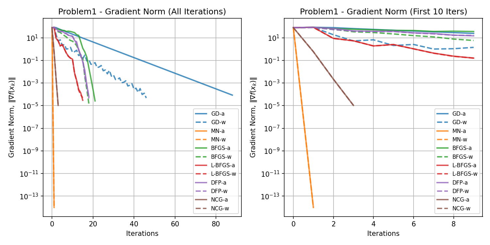
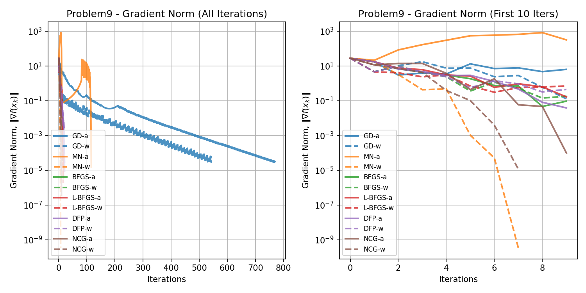
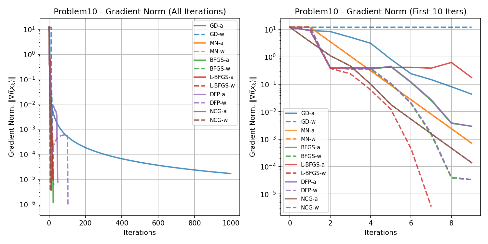
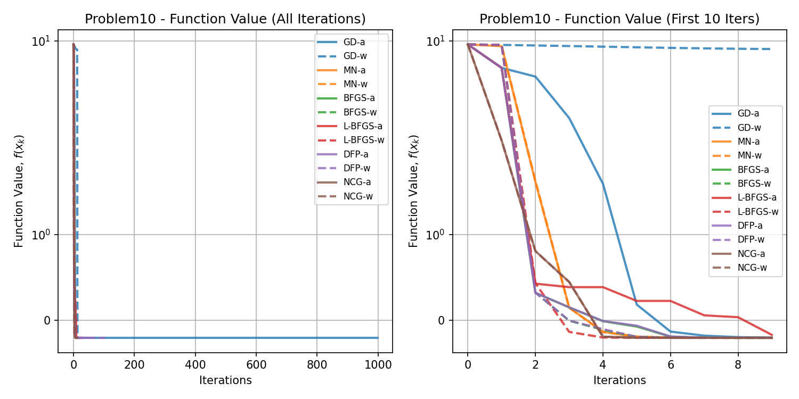

# Algorithms for Non-Linear Programming

## This repository contains implementations of various algorithms for solving non-linear programming problems.

### Getting Started

Install Python 3.10
```bash
sudo apt-get install python3.10-full
```

Install Venv Package
```bash
sudo apt-get install python3-venv
```

Create a virtual environment
```bash
python3.10 -m venv env
```

Activate the virtual environment
```bash
source env/bin/activate
```

Install the required packages
```bash
pip install -r requirements.txt
```

### How to Use

Run the specific problem script, for example:
```bash
python problem1.py
```

or run the main script to execute all problems:
```bash
python run_all_problems.py
```

To convert the markdown file to a PDF, use the following command:
```bash
pandoc README.md -o README.pdf -V geometry:margin=0.5in
```

## Results

Plots for each problem will be saved in the `figures` directory. Data for each problem will be saved in the `data` directory.

### Problem 1

<!-- BEGIN_Problem1_TABLE -->
|          |   Iters |        Time | Convergence                                  |   Func Evals |   Grad Evals |   Hess Evals |
|:---------|--------:|------------:|:---------------------------------------------|-------------:|-------------:|-------------:|
| GD-a     |      89 | 0.00834274  | Converged. Gradient norm is below tolerance. |         1599 |          179 |            0 |
| GD-w     |      46 | 0.00159717  | Converged. Gradient norm is below tolerance. |          202 |           47 |            0 |
| MN-a     |       1 | 0.0492518   | Converged. Gradient norm is below tolerance. |            3 |            4 |            2 |
| MN-w     |       1 | 0.0022552   | Converged. Gradient norm is below tolerance. |            3 |            3 |            2 |
| BFGS-a   |      21 | 0.00270796  | Converged. Gradient norm is below tolerance. |           92 |           65 |            0 |
| BFGS-w   |      18 | 0.000818253 | Converged. Gradient norm is below tolerance. |           49 |           38 |            0 |
| L-BFGS-a |      15 | 0.000999928 | Converged. Gradient norm is below tolerance. |           44 |           46 |            0 |
| L-BFGS-w |      15 | 0.000980139 | Converged. Gradient norm is below tolerance. |           33 |           31 |            0 |
| DFP-a    |      18 | 0.000730991 | Converged. Gradient norm is below tolerance. |           58 |           56 |            0 |
| DFP-w    |      18 | 0.00073719  | Converged. Gradient norm is below tolerance. |           41 |           38 |            0 |
| NCG-a    |       3 | 0.000432968 | Converged. Gradient norm is below tolerance. |            7 |            8 |            4 |
| NCG-w    |       3 | 0.000406027 | Converged. Gradient norm is below tolerance. |            7 |            5 |            4 |
<!-- END_Problem1_TABLE -->




### Problem 2

<!-- BEGIN_Problem2_TABLE -->
|          |   Iters |        Time | Convergence                                  |   Func Evals |   Grad Evals |   Hess Evals |
|:---------|--------:|------------:|:---------------------------------------------|-------------:|-------------:|-------------:|
| GD-a     |     999 | 0.0852475   | Failed. Maximum iterations reached.          |         8722 |         2000 |            0 |
| GD-w     |     999 | 0.0937407   | Failed. Maximum iterations reached.          |        10965 |         1000 |            0 |
| MN-a     |       1 | 0.000406504 | Converged. Gradient norm is below tolerance. |            3 |            4 |            2 |
| MN-w     |       1 | 0.000235081 | Converged. Gradient norm is below tolerance. |            3 |            3 |            2 |
| BFGS-a   |      12 | 0.00132084  | Converged. Gradient norm is below tolerance. |           81 |           38 |            0 |
| BFGS-w   |      12 | 0.00143337  | Converged. Gradient norm is below tolerance. |          100 |           26 |            0 |
| L-BFGS-a |      24 | 0.00286078  | Converged. Gradient norm is below tolerance. |           56 |           73 |            0 |
| L-BFGS-w |      27 | 0.00352979  | Converged. Gradient norm is below tolerance. |           67 |           55 |            0 |
| DFP-a    |      12 | 0.00122952  | Converged. Gradient norm is below tolerance. |           71 |           38 |            0 |
| DFP-w    |      13 | 0.0013504   | Converged. Gradient norm is below tolerance. |           81 |           28 |            0 |
| NCG-a    |       2 | 0.000596523 | Converged. Gradient norm is below tolerance. |            5 |            6 |            3 |
| NCG-w    |       2 | 0.000603676 | Converged. Gradient norm is below tolerance. |            5 |            4 |            3 |
<!-- END_Problem2_TABLE -->


### Problem 3

<!-- BEGIN_Problem3_TABLE -->
|          |   Iters |      Time | Convergence                                  |   Func Evals |   Grad Evals |   Hess Evals |
|:---------|--------:|----------:|:---------------------------------------------|-------------:|-------------:|-------------:|
| GD-a     |      46 | 0.072953  | Converged. Gradient norm is below tolerance. |          178 |           93 |            0 |
| GD-w     |      41 | 0.0725338 | Converged. Gradient norm is below tolerance. |          180 |           42 |            0 |
| MN-a     |       1 | 0.945208  | Converged. Gradient norm is below tolerance. |            3 |            4 |            2 |
| MN-w     |       1 | 0.949564  | Converged. Gradient norm is below tolerance. |            3 |            3 |            2 |
| BFGS-a   |      36 | 1.48786   | Converged. Gradient norm is below tolerance. |          111 |          110 |            0 |
| BFGS-w   |      59 | 2.51835   | Converged. Gradient norm is below tolerance. |          179 |          120 |            0 |
| L-BFGS-a |      23 | 0.100574  | Converged. Gradient norm is below tolerance. |           51 |           70 |            0 |
| L-BFGS-w |      21 | 0.0926821 | Converged. Gradient norm is below tolerance. |           46 |           43 |            0 |
| DFP-a    |      24 | 1.1155    | Converged. Gradient norm is below tolerance. |           74 |           74 |            0 |
| DFP-w    |      29 | 1.18345   | Converged. Gradient norm is below tolerance. |           88 |           60 |            0 |
| NCG-a    |       3 | 0.0627294 | Converged. Gradient norm is below tolerance. |            7 |            8 |            4 |
| NCG-w    |       3 | 0.105006  | Converged. Gradient norm is below tolerance. |            7 |            5 |            4 |
<!-- END_Problem3_TABLE -->


### Problem 4

<!-- BEGIN_Problem4_TABLE -->
|          |   Iters |      Time | Convergence                                  |   Func Evals |   Grad Evals |   Hess Evals |
|:---------|--------:|----------:|:---------------------------------------------|-------------:|-------------:|-------------:|
| GD-a     |     999 |  2.66288  | Failed. Maximum iterations reached.          |         8722 |         2000 |            0 |
| GD-w     |     999 |  4.07727  | Failed. Maximum iterations reached.          |        10965 |         1000 |            0 |
| MN-a     |       1 |  1.10098  | Converged. Gradient norm is below tolerance. |            3 |            4 |            2 |
| MN-w     |       1 |  1.22952  | Converged. Gradient norm is below tolerance. |            3 |            3 |            2 |
| BFGS-a   |     181 |  7.80866  | Converged. Gradient norm is below tolerance. |         1451 |          545 |            0 |
| BFGS-w   |     508 | 22.2446   | Converged. Gradient norm is below tolerance. |         4779 |         1018 |            0 |
| L-BFGS-a |     127 |  0.356493 | Converged. Gradient norm is below tolerance. |          267 |          382 |            0 |
| L-BFGS-w |     126 |  0.349955 | Converged. Gradient norm is below tolerance. |          267 |          253 |            0 |
| DFP-a    |     240 |  9.3101   | Converged. Gradient norm is below tolerance. |         1268 |          722 |            0 |
| DFP-w    |     288 | 12.2225   | Converged. Gradient norm is below tolerance. |         1750 |          578 |            0 |
| NCG-a    |       3 |  0.371059 | Converged. Gradient norm is below tolerance. |            7 |            8 |            4 |
| NCG-w    |       3 |  0.31185  | Converged. Gradient norm is below tolerance. |            7 |            5 |            4 |
<!-- END_Problem4_TABLE -->


### Problem 5

<!-- BEGIN_Problem5_TABLE -->
|          |   Iters |        Time | Convergence                                  |   Func Evals |   Grad Evals |   Hess Evals |
|:---------|--------:|------------:|:---------------------------------------------|-------------:|-------------:|-------------:|
| GD-a     |       3 | 0.000395536 | Converged. Gradient norm is below tolerance. |            7 |            7 |            0 |
| GD-w     |       3 | 0.000336409 | Converged. Gradient norm is below tolerance. |            7 |            4 |            0 |
| MN-a     |       3 | 0.000925064 | Converged. Gradient norm is below tolerance. |            7 |            8 |            4 |
| MN-w     |       3 | 0.00073576  | Converged. Gradient norm is below tolerance. |            7 |            5 |            4 |
| BFGS-a   |       3 | 0.000441313 | Converged. Gradient norm is below tolerance. |            7 |           11 |            0 |
| BFGS-w   |       3 | 0.000474691 | Converged. Gradient norm is below tolerance. |            7 |            8 |            0 |
| L-BFGS-a |       4 | 0.000579357 | Converged. Gradient norm is below tolerance. |            9 |           13 |            0 |
| L-BFGS-w |       4 | 0.000695467 | Converged. Gradient norm is below tolerance. |            9 |            9 |            0 |
| DFP-a    |       3 | 0.000430822 | Converged. Gradient norm is below tolerance. |            7 |           11 |            0 |
| DFP-w    |       3 | 0.000472307 | Converged. Gradient norm is below tolerance. |            7 |            8 |            0 |
| NCG-a    |       3 | 0.000498772 | Converged. Gradient norm is below tolerance. |            7 |            8 |            4 |
| NCG-w    |       3 | 0.000524521 | Converged. Gradient norm is below tolerance. |            7 |            5 |            4 |
<!-- END_Problem5_TABLE -->


### Problem 6

<!-- BEGIN_Problem6_TABLE -->
|          |   Iters |       Time | Convergence                                  |   Func Evals |   Grad Evals |   Hess Evals |
|:---------|--------:|-----------:|:---------------------------------------------|-------------:|-------------:|-------------:|
| GD-a     |       8 | 0.00157738 | Converged. Gradient norm is below tolerance. |          102 |           17 |            0 |
| GD-w     |       7 | 0.00156951 | Converged. Gradient norm is below tolerance. |          132 |            8 |            0 |
| MN-a     |      31 | 0.0182481  | Converged. Gradient norm is below tolerance. |           63 |           64 |           32 |
| MN-w     |      31 | 0.0174356  | Converged. Gradient norm is below tolerance. |           63 |           33 |           32 |
| BFGS-a   |      26 | 0.00375772 | Converged. Gradient norm is below tolerance. |          113 |           80 |            0 |
| BFGS-w   |      24 | 0.00390363 | Converged. Gradient norm is below tolerance. |          129 |           50 |            0 |
| L-BFGS-a |      15 | 0.00227237 | Converged. Gradient norm is below tolerance. |           47 |           46 |            0 |
| L-BFGS-w |      14 | 0.00236773 | Converged. Gradient norm is below tolerance. |           50 |           29 |            0 |
| DFP-a    |     142 | 0.0166104  | Converged. Gradient norm is below tolerance. |          344 |          428 |            0 |
| DFP-w    |     393 | 0.0511451  | Converged. Gradient norm is below tolerance. |          867 |          788 |            0 |
| NCG-a    |      57 | 0.0229957  | Converged. Gradient norm is below tolerance. |          611 |          116 |           58 |
| NCG-w    |      59 | 0.0253308  | Converged. Gradient norm is below tolerance. |          898 |           61 |           60 |
<!-- END_Problem6_TABLE -->


### Problem 7

<!-- BEGIN_Problem7_TABLE -->
|          |   Iters |       Time | Convergence                                  |   Func Evals |   Grad Evals |   Hess Evals |
|:---------|--------:|-----------:|:---------------------------------------------|-------------:|-------------:|-------------:|
| GD-a     |     999 | 0.0857866  | Failed. Maximum iterations reached.          |         8923 |         2000 |            0 |
| GD-w     |     999 | 0.0853806  | Failed. Maximum iterations reached.          |        10881 |         1001 |            0 |
| MN-a     |      20 | 0.00281167 | Converged. Gradient norm is below tolerance. |           47 |           42 |           21 |
| MN-w     |      20 | 0.00283647 | Converged. Gradient norm is below tolerance. |           48 |           22 |           21 |
| BFGS-a   |      35 | 0.00335741 | Converged. Gradient norm is below tolerance. |           90 |          107 |            0 |
| BFGS-w   |      33 | 0.00367308 | Converged. Gradient norm is below tolerance. |           86 |           68 |            0 |
| L-BFGS-a |      39 | 0.00447989 | Converged. Gradient norm is below tolerance. |          108 |          118 |            0 |
| L-BFGS-w |      37 | 0.00418043 | Converged. Gradient norm is below tolerance. |           95 |           83 |            0 |
| DFP-a    |     999 | 0.0932341  | Failed. Maximum iterations reached.          |         2031 |         3001 |            0 |
| DFP-w    |      35 | 0.00395656 | Converged. Gradient norm is below tolerance. |           88 |           76 |            0 |
| NCG-a    |      21 | 0.00224209 | Converged. Gradient norm is below tolerance. |           49 |           44 |           22 |
| NCG-w    |      20 | 0.00249839 | Converged. Gradient norm is below tolerance. |           48 |           22 |           21 |
<!-- END_Problem7_TABLE -->


### Problem 8

<!-- BEGIN_Problem8_TABLE -->
|          |   Iters |       Time | Convergence                                  |   Func Evals |   Grad Evals |   Hess Evals |
|:---------|--------:|-----------:|:---------------------------------------------|-------------:|-------------:|-------------:|
| GD-a     |      23 | 0.00904632 | Converged. Gradient norm is below tolerance. |          218 |           47 |            0 |
| GD-w     |      45 | 0.0232189  | Converged. Gradient norm is below tolerance. |          540 |           46 |            0 |
| MN-a     |      74 | 0.356224   | Converged. Gradient norm is below tolerance. |          149 |          150 |           75 |
| MN-w     |      74 | 0.368056   | Converged. Gradient norm is below tolerance. |          149 |           76 |           75 |
| BFGS-a   |     110 | 0.102041   | Converged. Gradient norm is below tolerance. |          924 |          332 |            0 |
| BFGS-w   |     112 | 0.0890164  | Converged. Gradient norm is below tolerance. |         1124 |          226 |            0 |
| L-BFGS-a |      20 | 0.0100827  | Converged. Gradient norm is below tolerance. |           50 |           61 |            0 |
| L-BFGS-w |      20 | 0.0123529  | Converged. Gradient norm is below tolerance. |           53 |           41 |            0 |
| DFP-a    |     108 | 0.0655756  | Converged. Gradient norm is below tolerance. |          623 |          326 |            0 |
| DFP-w    |     110 | 0.0982966  | Converged. Gradient norm is below tolerance. |          730 |          222 |            0 |
| NCG-a    |      76 | 0.0471478  | Converged. Gradient norm is below tolerance. |          153 |          154 |           77 |
| NCG-w    |      76 | 0.0563343  | Converged. Gradient norm is below tolerance. |          153 |           78 |           77 |
<!-- END_Problem8_TABLE -->


### Problem 9

<!-- BEGIN_Problem9_TABLE -->
|          |   Iters |        Time | Convergence                                  |   Func Evals |   Grad Evals |   Hess Evals |
|:---------|--------:|------------:|:---------------------------------------------|-------------:|-------------:|-------------:|
| GD-a     |     335 | 0.0262542   | Converged. Gradient norm is below tolerance. |         1740 |          671 |            0 |
| GD-w     |     543 | 0.0440662   | Converged. Gradient norm is below tolerance. |         3523 |          544 |            0 |
| MN-a     |       6 | 0.000978947 | Converged. Gradient norm is below tolerance. |           25 |           14 |            7 |
| MN-w     |       7 | 0.00108075  | Converged. Gradient norm is below tolerance. |           55 |            9 |            8 |
| BFGS-a   |      14 | 0.00116396  | Converged. Gradient norm is below tolerance. |           36 |           44 |            0 |
| BFGS-w   |      14 | 0.00129557  | Converged. Gradient norm is below tolerance. |           37 |           30 |            0 |
| L-BFGS-a |      16 | 0.00131512  | Converged. Gradient norm is below tolerance. |           39 |           49 |            0 |
| L-BFGS-w |      16 | 0.00149012  | Converged. Gradient norm is below tolerance. |           44 |           33 |            0 |
| DFP-a    |      22 | 0.00167918  | Converged. Gradient norm is below tolerance. |           52 |           68 |            0 |
| DFP-w    |      21 | 0.00187778  | Converged. Gradient norm is below tolerance. |           51 |           44 |            0 |
| NCG-a    |       8 | 0.000794649 | Converged. Gradient norm is below tolerance. |           19 |           18 |            9 |
| NCG-w    |       7 | 0.000747204 | Converged. Gradient norm is below tolerance. |           17 |            9 |            8 |
<!-- END_Problem9_TABLE -->




### Problem 10

<!-- BEGIN_Problem10_TABLE -->
|          |   Iters |       Time | Convergence                                  |   Func Evals |   Grad Evals |   Hess Evals |
|:---------|--------:|-----------:|:---------------------------------------------|-------------:|-------------:|-------------:|
| GD-a     |     999 | 0.0701935  | Failed. Maximum iterations reached.          |         2001 |         2000 |            0 |
| GD-w     |      26 | 0.0024941  | Converged. Gradient norm is below tolerance. |           67 |           27 |            0 |
| MN-a     |      13 | 0.00245905 | Converged. Gradient norm is below tolerance. |           35 |           28 |           14 |
| MN-w     |      13 | 0.00232315 | Converged. Gradient norm is below tolerance. |           37 |           15 |           14 |
| BFGS-a   |      19 | 0.00230002 | Converged. Gradient norm is below tolerance. |           41 |           59 |            0 |
| BFGS-w   |      19 | 0.00261617 | Converged. Gradient norm is below tolerance. |           42 |           41 |            0 |
| L-BFGS-a |      19 | 0.00319028 | Converged. Gradient norm is below tolerance. |           42 |           58 |            0 |
| L-BFGS-w |       7 | 0.00127006 | Converged. Gradient norm is below tolerance. |           18 |           19 |            0 |
| DFP-a    |      56 | 0.00652218 | Converged. Gradient norm is below tolerance. |          118 |          170 |            0 |
| DFP-w    |     104 | 0.0139029  | Converged. Gradient norm is below tolerance. |          215 |          222 |            0 |
| NCG-a    |      12 | 0.00142813 | Converged. Gradient norm is below tolerance. |           25 |           26 |           13 |
| NCG-w    |      12 | 0.00169826 | Converged. Gradient norm is below tolerance. |           25 |           14 |           13 |
<!-- END_Problem10_TABLE -->





### Problem 11

<!-- BEGIN_Problem11_TABLE -->
|          |   Iters |      Time | Convergence                                  |   Func Evals |   Grad Evals |   Hess Evals |
|:---------|--------:|----------:|:---------------------------------------------|-------------:|-------------:|-------------:|
| GD-a     |     999 | 0.735502  | Failed. Maximum iterations reached.          |         2001 |         2000 |            0 |
| GD-w     |      13 | 0.0163422 | Converged. Gradient norm is below tolerance. |           29 |           16 |            0 |
| MN-a     |      13 | 0.794621  | Converged. Gradient norm is below tolerance. |           35 |           28 |           14 |
| MN-w     |      13 | 0.862959  | Converged. Gradient norm is below tolerance. |           37 |           15 |           14 |
| BFGS-a   |      19 | 0.823527  | Converged. Gradient norm is below tolerance. |           40 |           59 |            0 |
| BFGS-w   |       5 | 0.218202  | Converged. Gradient norm is below tolerance. |           16 |           14 |            0 |
| L-BFGS-a |      15 | 0.0533395 | Converged. Gradient norm is below tolerance. |           32 |           46 |            0 |
| L-BFGS-w |       5 | 0.0271885 | Converged. Gradient norm is below tolerance. |           16 |           15 |            0 |
| DFP-a    |      20 | 0.91292   | Converged. Gradient norm is below tolerance. |           42 |           62 |            0 |
| DFP-w    |       5 | 0.310616  | Converged. Gradient norm is below tolerance. |           16 |           14 |            0 |
| NCG-a    |      12 | 0.252544  | Converged. Gradient norm is below tolerance. |           25 |           26 |           13 |
| NCG-w    |      12 | 0.0918741 | Converged. Gradient norm is below tolerance. |           25 |           14 |           13 |
<!-- END_Problem11_TABLE -->


### Problem 12

<!-- BEGIN_Problem12_TABLE -->
|          |   Iters |       Time | Convergence                                  |   Func Evals |   Grad Evals |   Hess Evals |
|:---------|--------:|-----------:|:---------------------------------------------|-------------:|-------------:|-------------:|
| GD-a     |     146 | 0.0233016  | Converged. Gradient norm is below tolerance. |          352 |          293 |            0 |
| GD-w     |     209 | 0.0470793  | Converged. Gradient norm is below tolerance. |          674 |          223 |            0 |
| MN-a     |      69 | 0.0307856  | Converged. Gradient norm is below tolerance. |          613 |          140 |           70 |
| MN-w     |      82 | 0.0424604  | Converged. Gradient norm is below tolerance. |          920 |           88 |           83 |
| BFGS-a   |      72 | 0.0176868  | Converged. Gradient norm is below tolerance. |          179 |          218 |            0 |
| BFGS-w   |      47 | 0.0138445  | Converged. Gradient norm is below tolerance. |          111 |           98 |            0 |
| L-BFGS-a |      26 | 0.00723386 | Converged. Gradient norm is below tolerance. |           64 |           79 |            0 |
| L-BFGS-w |      27 | 0.00877953 | Converged. Gradient norm is below tolerance. |           65 |           55 |            0 |
| DFP-a    |     999 | 0.245044   | Failed. Maximum iterations reached.          |         2025 |         3001 |            0 |
| DFP-w    |     999 | 0.283537   | Failed. Maximum iterations reached.          |         2029 |         2066 |            0 |
| NCG-a    |      55 | 0.0145164  | Converged. Gradient norm is below tolerance. |          122 |          112 |           56 |
| NCG-w    |      30 | 0.0100608  | Converged. Gradient norm is below tolerance. |           66 |           42 |           31 |
<!-- END_Problem12_TABLE -->


