# Algorithms for Solving Non-Linear Optimization Problems

## This repository contains implementations of various algorithms for solving non-linear optimization problems

The algorithms implemented include:

- Gradient Descent (GD)
- Modified Newton (MN)
- Broyden-Fletcher-Goldfarb-Shanno (BFGS)
- Limited-memory BFGS (L-BFGS)
- Davidon-Fletcher-Powell (DFP)
- Newton Conjugate Gradient (NCG)

Each algorithm has two variants for the line search:

- Armijo Line Search (a)
- Wolfe Line Search (w)

Each algorithm and line search combination is tested on 12 different optimization problems.

### Getting Started

Install Python 3.10
```bash
sudo apt-get install python3.10-full
```

Install Venv Package
```bash
sudo apt-get install python3-venv
```

Create a virtual environment
```bash
python3.10 -m venv env
```

Activate the virtual environment
```bash
source env/bin/activate
```

Install the required packages
```bash
pip install -r requirements.txt
```

### How to Use

Run the specific problem script, for example:
```bash
python problem1.py
```

or run the main script to execute all problems:
```bash
python run_all_problems.py
```

To convert the markdown file to a PDF, use the following command:
```bash
pandoc README.md -o results.pdf -V geometry:margin=0.5in
```

## Results

Plots for each problem will be saved in the `figures` directory. Data for each problem will be saved in the `data` directory.

### Problem 1

<!-- BEGIN_Problem1_TABLE -->
|          |   Iters |        Time | Convergence                                  |   Func Evals |   Grad Evals |   Hess Evals |
|:---------|--------:|------------:|:---------------------------------------------|-------------:|-------------:|-------------:|
| GD-a     |      89 | 0.0144293   | Converged. Gradient norm is below tolerance. |         1599 |          179 |            0 |
| GD-w     |      46 | 0.00298548  | Converged. Gradient norm is below tolerance. |          202 |           47 |            0 |
| MN-a     |       1 | 0.00153804  | Converged. Gradient norm is below tolerance. |            3 |            4 |            2 |
| MN-w     |       1 | 0.000247002 | Converged. Gradient norm is below tolerance. |            3 |            3 |            2 |
| BFGS-a   |      21 | 0.00204563  | Converged. Gradient norm is below tolerance. |           92 |           65 |            0 |
| BFGS-w   |      18 | 0.00169015  | Converged. Gradient norm is below tolerance. |           49 |           38 |            0 |
| L-BFGS-a |      15 | 0.00184393  | Converged. Gradient norm is below tolerance. |           44 |           46 |            0 |
| L-BFGS-w |      15 | 0.001894    | Converged. Gradient norm is below tolerance. |           33 |           31 |            0 |
| DFP-a    |      18 | 0.00151396  | Converged. Gradient norm is below tolerance. |           58 |           56 |            0 |
| DFP-w    |      18 | 0.00152302  | Converged. Gradient norm is below tolerance. |           41 |           38 |            0 |
| NCG-a    |       3 | 0.000693083 | Converged. Gradient norm is below tolerance. |            7 |            8 |            4 |
| NCG-w    |       3 | 0.000681162 | Converged. Gradient norm is below tolerance. |            7 |            5 |            4 |
<!-- END_Problem1_TABLE -->


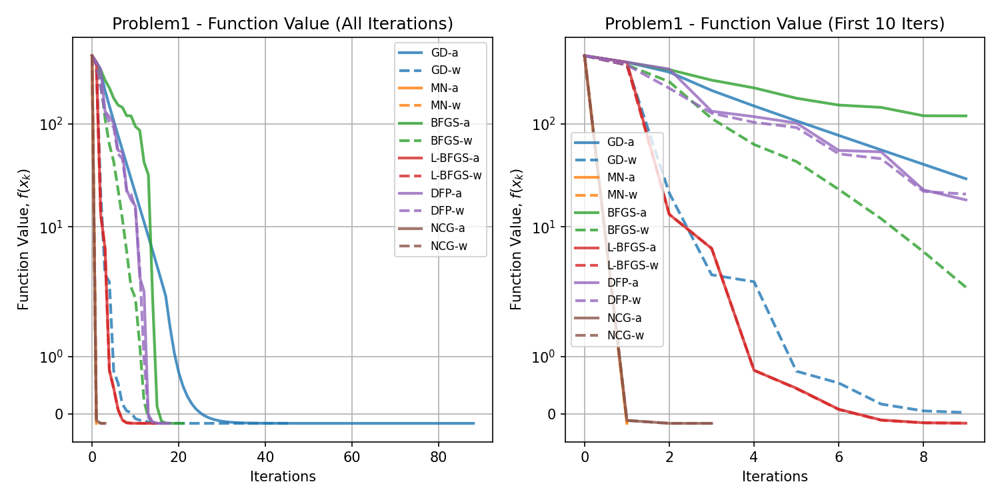


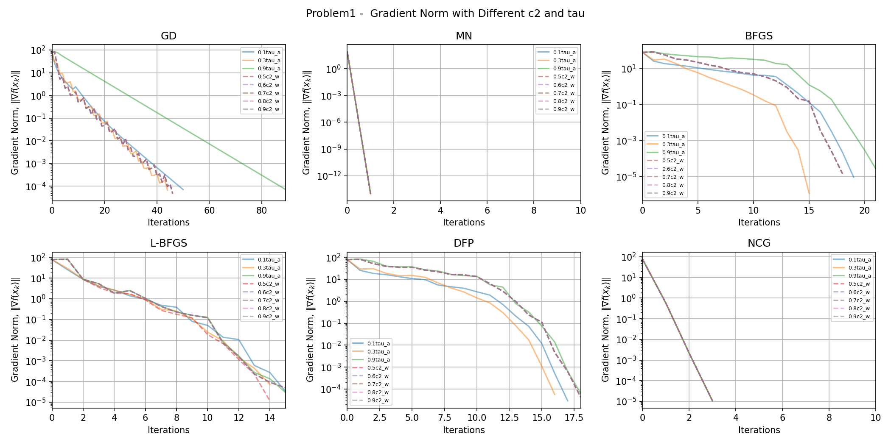


### Problem 2

<!-- BEGIN_Problem2_TABLE -->
|          |   Iters |        Time | Convergence                                  |   Func Evals |   Grad Evals |   Hess Evals |
|:---------|--------:|------------:|:---------------------------------------------|-------------:|-------------:|-------------:|
| GD-a     |     999 | 0.46963     | Failed. Maximum iterations reached.          |        60998 |         2000 |            0 |
| GD-w     |     999 | 0.106984    | Failed. Maximum iterations reached.          |        10965 |         1000 |            0 |
| MN-a     |       1 | 0.000394821 | Converged. Gradient norm is below tolerance. |            3 |            4 |            2 |
| MN-w     |       1 | 0.000270605 | Converged. Gradient norm is below tolerance. |            3 |            3 |            2 |
| BFGS-a   |      13 | 0.00450945  | Converged. Gradient norm is below tolerance. |          489 |           41 |            0 |
| BFGS-w   |      12 | 0.00158501  | Converged. Gradient norm is below tolerance. |          100 |           26 |            0 |
| L-BFGS-a |      26 | 0.00386119  | Converged. Gradient norm is below tolerance. |          114 |           79 |            0 |
| L-BFGS-w |      27 | 0.00379038  | Converged. Gradient norm is below tolerance. |           67 |           55 |            0 |
| DFP-a    |      14 | 0.00326848  | Converged. Gradient norm is below tolerance. |          321 |           44 |            0 |
| DFP-w    |      13 | 0.00146627  | Converged. Gradient norm is below tolerance. |           81 |           28 |            0 |
| NCG-a    |       2 | 0.000643015 | Converged. Gradient norm is below tolerance. |            5 |            6 |            3 |
| NCG-w    |       2 | 0.000637531 | Converged. Gradient norm is below tolerance. |            5 |            4 |            3 |
<!-- END_Problem2_TABLE -->

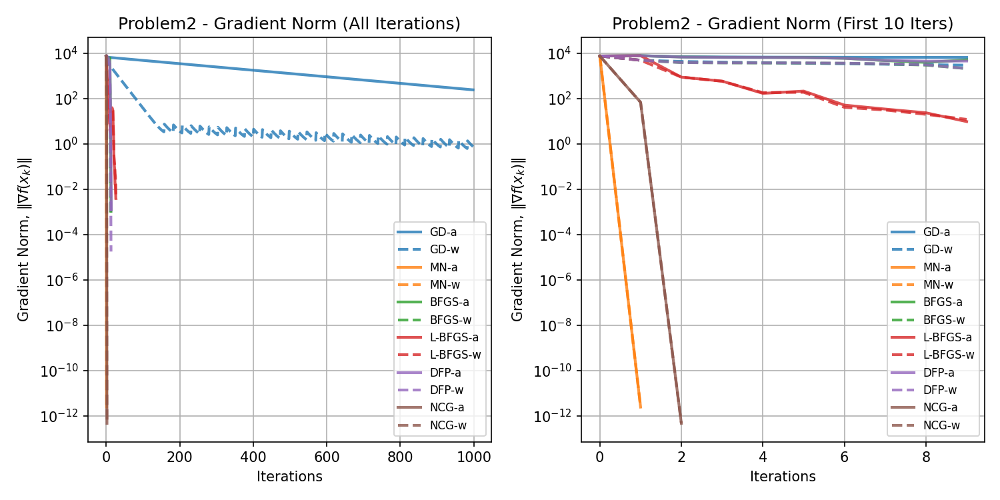


### Problem 3

<!-- BEGIN_Problem3_TABLE -->
|          |   Iters |      Time | Convergence                                  |   Func Evals |   Grad Evals |   Hess Evals |
|:---------|--------:|----------:|:---------------------------------------------|-------------:|-------------:|-------------:|
| GD-a     |      88 | 0.396377  | Converged. Gradient norm is below tolerance. |         1574 |          177 |            0 |
| GD-w     |      41 | 0.0774596 | Converged. Gradient norm is below tolerance. |          180 |           42 |            0 |
| MN-a     |       1 | 0.998708  | Converged. Gradient norm is below tolerance. |            3 |            4 |            2 |
| MN-w     |       1 | 0.958103  | Converged. Gradient norm is below tolerance. |            3 |            3 |            2 |
| BFGS-a   |     227 | 9.21601   | Converged. Gradient norm is below tolerance. |         1361 |          683 |            0 |
| BFGS-w   |      59 | 2.37059   | Converged. Gradient norm is below tolerance. |          179 |          120 |            0 |
| L-BFGS-a |      21 | 0.0642378 | Converged. Gradient norm is below tolerance. |           59 |           64 |            0 |
| L-BFGS-w |      21 | 0.0641718 | Converged. Gradient norm is below tolerance. |           46 |           43 |            0 |
| DFP-a    |     104 | 3.65116   | Converged. Gradient norm is below tolerance. |          229 |          314 |            0 |
| DFP-w    |      29 | 1.01067   | Converged. Gradient norm is below tolerance. |           88 |           60 |            0 |
| NCG-a    |       3 | 0.0570514 | Converged. Gradient norm is below tolerance. |            7 |            8 |            4 |
| NCG-w    |       3 | 0.0571702 | Converged. Gradient norm is below tolerance. |            7 |            5 |            4 |
<!-- END_Problem3_TABLE -->


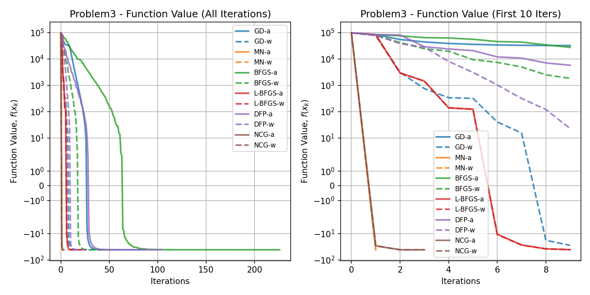


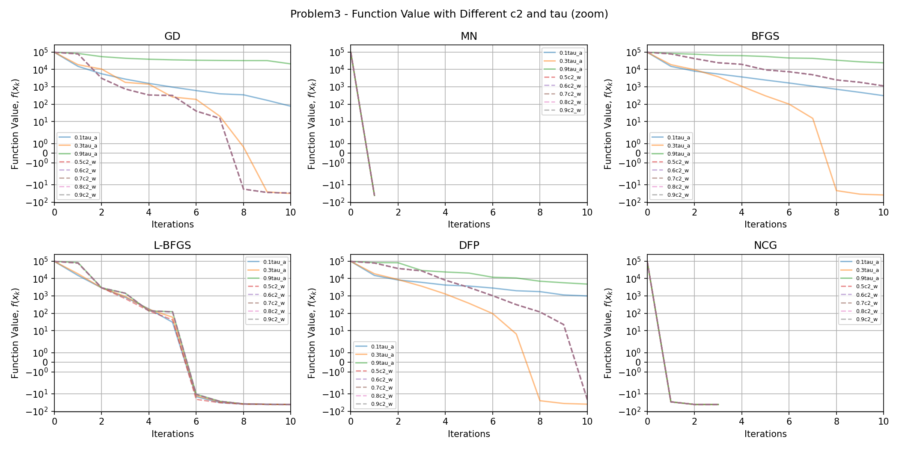


### Problem 4

<!-- BEGIN_Problem4_TABLE -->
|          |   Iters |      Time | Convergence                                  |   Func Evals |   Grad Evals |   Hess Evals |
|:---------|--------:|----------:|:---------------------------------------------|-------------:|-------------:|-------------:|
| GD-a     |     999 | 11.7596   | Failed. Maximum iterations reached.          |        60997 |         2000 |            0 |
| GD-w     |     999 |  2.74733  | Failed. Maximum iterations reached.          |        10965 |         1000 |            0 |
| MN-a     |       1 |  0.992127 | Converged. Gradient norm is below tolerance. |            3 |            4 |            2 |
| MN-w     |       1 |  0.982068 | Converged. Gradient norm is below tolerance. |            3 |            3 |            2 |
| BFGS-a   |     999 | 46.23     | Failed. Maximum iterations reached.          |        47127 |         3001 |            0 |
| BFGS-w   |     508 | 20.0932   | Converged. Gradient norm is below tolerance. |         4779 |         1018 |            0 |
| L-BFGS-a |     123 |  0.367558 | Converged. Gradient norm is below tolerance. |          316 |          370 |            0 |
| L-BFGS-w |     126 |  0.354212 | Converged. Gradient norm is below tolerance. |          267 |          253 |            0 |
| DFP-a    |     864 | 39.9289   | Converged. Gradient norm is below tolerance. |        19411 |         2594 |            0 |
| DFP-w    |     288 | 10.0012   | Converged. Gradient norm is below tolerance. |         1750 |          578 |            0 |
| NCG-a    |       3 |  0.304365 | Converged. Gradient norm is below tolerance. |            7 |            8 |            4 |
| NCG-w    |       3 |  0.319217 | Converged. Gradient norm is below tolerance. |            7 |            5 |            4 |
<!-- END_Problem4_TABLE -->


### Problem 5

<!-- BEGIN_Problem5_TABLE -->
|          |   Iters |        Time | Convergence                                  |   Func Evals |   Grad Evals |   Hess Evals |
|:---------|--------:|------------:|:---------------------------------------------|-------------:|-------------:|-------------:|
| GD-a     |       2 | 0.000328779 | Converged. Gradient norm is below tolerance. |            5 |            5 |            0 |
| GD-w     |       2 | 0.000269413 | Converged. Gradient norm is below tolerance. |            5 |            3 |            0 |
| MN-a     |       2 | 0.00072217  | Converged. Gradient norm is below tolerance. |            5 |            6 |            3 |
| MN-w     |       2 | 0.000583649 | Converged. Gradient norm is below tolerance. |            5 |            4 |            3 |
| BFGS-a   |       3 | 0.000513315 | Converged. Gradient norm is below tolerance. |            7 |           11 |            0 |
| BFGS-w   |       3 | 0.00051403  | Converged. Gradient norm is below tolerance. |            7 |            8 |            0 |
| L-BFGS-a |       3 | 0.000490189 | Converged. Gradient norm is below tolerance. |            7 |           10 |            0 |
| L-BFGS-w |       3 | 0.000533819 | Converged. Gradient norm is below tolerance. |            7 |            7 |            0 |
| DFP-a    |       3 | 0.000446558 | Converged. Gradient norm is below tolerance. |            7 |           11 |            0 |
| DFP-w    |       3 | 0.000475168 | Converged. Gradient norm is below tolerance. |            7 |            8 |            0 |
| NCG-a    |       2 | 0.000369072 | Converged. Gradient norm is below tolerance. |            5 |            6 |            3 |
| NCG-w    |       2 | 0.00038147  | Converged. Gradient norm is below tolerance. |            5 |            4 |            3 |
<!-- END_Problem5_TABLE -->


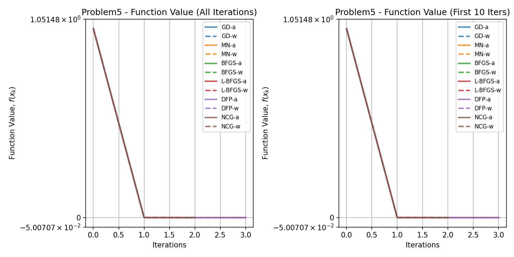

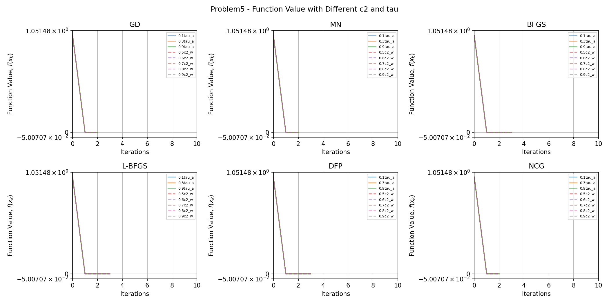


### Problem 6

<!-- BEGIN_Problem6_TABLE -->
|          |   Iters |       Time | Convergence                                  |   Func Evals |   Grad Evals |   Hess Evals |
|:---------|--------:|-----------:|:---------------------------------------------|-------------:|-------------:|-------------:|
| GD-a     |      49 | 0.0392861  | Converged. Gradient norm is below tolerance. |         3463 |           99 |            0 |
| GD-w     |       6 | 0.00125885 | Converged. Gradient norm is below tolerance. |           94 |            7 |            0 |
| MN-a     |      31 | 0.016115   | Converged. Gradient norm is below tolerance. |           63 |           64 |           32 |
| MN-w     |      31 | 0.0159855  | Converged. Gradient norm is below tolerance. |           63 |           33 |           32 |
| BFGS-a   |      12 | 0.00611877 | Converged. Gradient norm is below tolerance. |          458 |           38 |            0 |
| BFGS-w   |      24 | 0.00392342 | Converged. Gradient norm is below tolerance. |          111 |           50 |            0 |
| L-BFGS-a |      14 | 0.00323486 | Converged. Gradient norm is below tolerance. |          145 |           43 |            0 |
| L-BFGS-w |      15 | 0.00260091 | Converged. Gradient norm is below tolerance. |           49 |           31 |            0 |
| DFP-a    |      14 | 0.00610757 | Converged. Gradient norm is below tolerance. |          451 |           44 |            0 |
| DFP-w    |      65 | 0.00919867 | Converged. Gradient norm is below tolerance. |          192 |          132 |            0 |
| NCG-a    |     999 | 3.48405    | Failed. Maximum iterations reached.          |       349443 |         2001 |         1000 |
| NCG-w    |     999 | 0.715034   | Failed. Maximum iterations reached.          |        71398 |         1001 |         1000 |
<!-- END_Problem6_TABLE -->


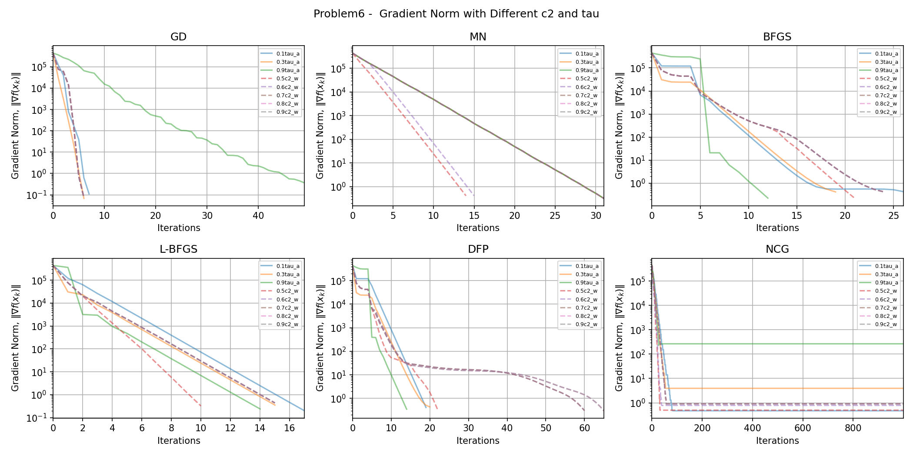


### Problem 7

<!-- BEGIN_Problem7_TABLE -->
|          |   Iters |       Time | Convergence                                  |   Func Evals |   Grad Evals |   Hess Evals |
|:---------|--------:|-----------:|:---------------------------------------------|-------------:|-------------:|-------------:|
| GD-a     |     999 | 0.439839   | Failed. Maximum iterations reached.          |        66070 |         2000 |            0 |
| GD-w     |     999 | 0.0946846  | Failed. Maximum iterations reached.          |        10881 |         1001 |            0 |
| MN-a     |      19 | 0.00315094 | Converged. Gradient norm is below tolerance. |           95 |           40 |           20 |
| MN-w     |      20 | 0.00304937 | Converged. Gradient norm is below tolerance. |           48 |           22 |           21 |
| BFGS-a   |      18 | 0.00251579 | Converged. Gradient norm is below tolerance. |          143 |           56 |            0 |
| BFGS-w   |      33 | 0.0038867  | Converged. Gradient norm is below tolerance. |           86 |           68 |            0 |
| L-BFGS-a |      23 | 0.00288868 | Converged. Gradient norm is below tolerance. |          129 |           70 |            0 |
| L-BFGS-w |      37 | 0.00453901 | Converged. Gradient norm is below tolerance. |           95 |           83 |            0 |
| DFP-a    |     251 | 0.0238671  | Converged. Gradient norm is below tolerance. |          612 |          755 |            0 |
| DFP-w    |      35 | 0.00393677 | Converged. Gradient norm is below tolerance. |           88 |           76 |            0 |
| NCG-a    |      19 | 0.00245333 | Converged. Gradient norm is below tolerance. |           95 |           40 |           20 |
| NCG-w    |      20 | 0.00254416 | Converged. Gradient norm is below tolerance. |           48 |           22 |           21 |
<!-- END_Problem7_TABLE -->


### Problem 8

<!-- BEGIN_Problem8_TABLE -->
|          |   Iters |      Time | Convergence                                  |   Func Evals |   Grad Evals |   Hess Evals |
|:---------|--------:|----------:|:---------------------------------------------|-------------:|-------------:|-------------:|
| GD-a     |     132 | 0.140508  | Converged. Gradient norm is below tolerance. |         8832 |          265 |            0 |
| GD-w     |      45 | 0.0243149 | Converged. Gradient norm is below tolerance. |          540 |           46 |            0 |
| MN-a     |      74 | 0.358855  | Converged. Gradient norm is below tolerance. |          149 |          150 |           75 |
| MN-w     |      74 | 0.36906   | Converged. Gradient norm is below tolerance. |          149 |           76 |           75 |
| BFGS-a   |     119 | 0.158617  | Converged. Gradient norm is below tolerance. |         5847 |          359 |            0 |
| BFGS-w   |     112 | 0.0903254 | Converged. Gradient norm is below tolerance. |         1124 |          226 |            0 |
| L-BFGS-a |      21 | 0.0120935 | Converged. Gradient norm is below tolerance. |          112 |           64 |            0 |
| L-BFGS-w |      20 | 0.0129056 | Converged. Gradient norm is below tolerance. |           53 |           41 |            0 |
| DFP-a    |     117 | 0.0989053 | Converged. Gradient norm is below tolerance. |         2889 |          353 |            0 |
| DFP-w    |     110 | 0.0820246 | Converged. Gradient norm is below tolerance. |          730 |          222 |            0 |
| NCG-a    |      76 | 0.0487905 | Converged. Gradient norm is below tolerance. |          153 |          154 |           77 |
| NCG-w    |      76 | 0.0585678 | Converged. Gradient norm is below tolerance. |          153 |           78 |           77 |
<!-- END_Problem8_TABLE -->


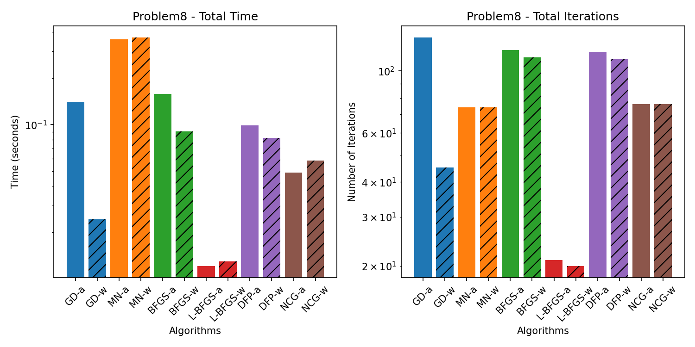


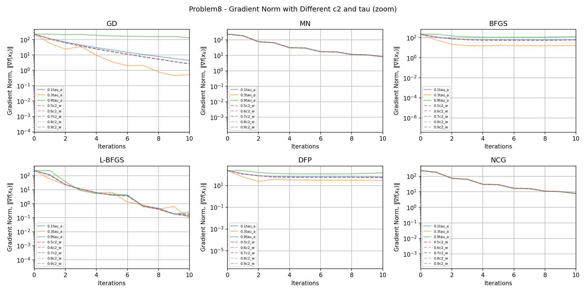

### Problem 9

<!-- BEGIN_Problem9_TABLE -->
|          |   Iters |       Time | Convergence                                  |   Func Evals |   Grad Evals |   Hess Evals |
|:---------|--------:|-----------:|:---------------------------------------------|-------------:|-------------:|-------------:|
| GD-a     |     770 | 0.216622   | Converged. Gradient norm is below tolerance. |        24495 |         1541 |            0 |
| GD-w     |     543 | 0.0536568  | Converged. Gradient norm is below tolerance. |         3523 |          544 |            0 |
| MN-a     |     116 | 0.0230932  | Converged. Gradient norm is below tolerance. |         1008 |          234 |          117 |
| MN-w     |       7 | 0.00151277 | Converged. Gradient norm is below tolerance. |           55 |            9 |            8 |
| BFGS-a   |      17 | 0.00241065 | Converged. Gradient norm is below tolerance. |           84 |           53 |            0 |
| BFGS-w   |      14 | 0.00196934 | Converged. Gradient norm is below tolerance. |           37 |           30 |            0 |
| L-BFGS-a |      17 | 0.00225377 | Converged. Gradient norm is below tolerance. |           67 |           52 |            0 |
| L-BFGS-w |      16 | 0.002249   | Converged. Gradient norm is below tolerance. |           44 |           33 |            0 |
| DFP-a    |      21 | 0.00273633 | Converged. Gradient norm is below tolerance. |           93 |           65 |            0 |
| DFP-w    |      21 | 0.00269604 | Converged. Gradient norm is below tolerance. |           51 |           44 |            0 |
| NCG-a    |      10 | 0.00146031 | Converged. Gradient norm is below tolerance. |           39 |           22 |           11 |
| NCG-w    |       7 | 0.0011251  | Converged. Gradient norm is below tolerance. |           17 |            9 |            8 |
<!-- END_Problem9_TABLE -->


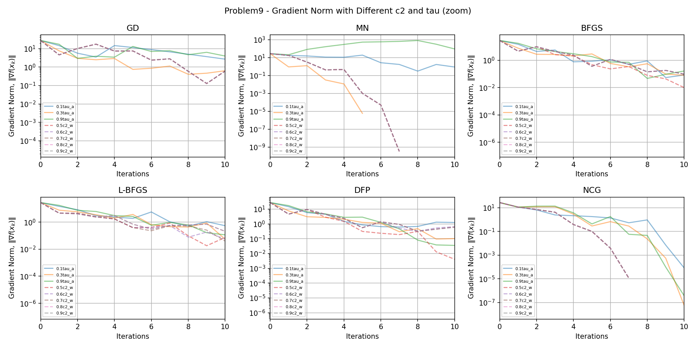

### Problem 10

<!-- BEGIN_Problem10_TABLE -->
|          |   Iters |       Time | Convergence                                  |   Func Evals |   Grad Evals |   Hess Evals |
|:---------|--------:|-----------:|:---------------------------------------------|-------------:|-------------:|-------------:|
| GD-a     |     999 | 0.106802   | Failed. Maximum iterations reached.          |         2019 |         2000 |            0 |
| GD-w     |      26 | 0.00361109 | Converged. Gradient norm is below tolerance. |           67 |           27 |            0 |
| MN-a     |      13 | 0.00429225 | Converged. Gradient norm is below tolerance. |           93 |           28 |           14 |
| MN-w     |      13 | 0.00318384 | Converged. Gradient norm is below tolerance. |           37 |           15 |           14 |
| BFGS-a   |      23 | 0.00413561 | Converged. Gradient norm is below tolerance. |           59 |           71 |            0 |
| BFGS-w   |      19 | 0.00379848 | Converged. Gradient norm is below tolerance. |           42 |           41 |            0 |
| L-BFGS-a |      21 | 0.0173724  | Converged. Gradient norm is below tolerance. |          799 |           64 |            0 |
| L-BFGS-w |       7 | 0.00175238 | Converged. Gradient norm is below tolerance. |           18 |           19 |            0 |
| DFP-a    |      48 | 0.00837111 | Converged. Gradient norm is below tolerance. |          137 |          146 |            0 |
| DFP-w    |     104 | 0.0192931  | Converged. Gradient norm is below tolerance. |          215 |          222 |            0 |
| NCG-a    |      12 | 0.00206304 | Converged. Gradient norm is below tolerance. |           25 |           26 |           13 |
| NCG-w    |      12 | 0.00231838 | Converged. Gradient norm is below tolerance. |           25 |           14 |           13 |
<!-- END_Problem10_TABLE -->


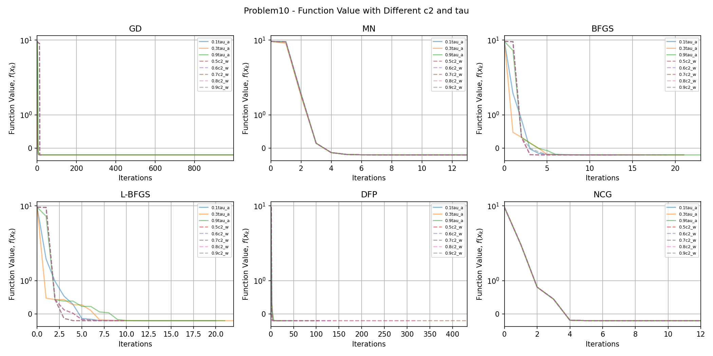


### Problem 11

<!-- BEGIN_Problem11_TABLE -->
|          |   Iters |      Time | Convergence                                  |   Func Evals |   Grad Evals |   Hess Evals |
|:---------|--------:|----------:|:---------------------------------------------|-------------:|-------------:|-------------:|
| GD-a     |     999 | 1.03768   | Failed. Maximum iterations reached.          |         2019 |         2000 |            0 |
| GD-w     |      13 | 0.0217977 | Converged. Gradient norm is below tolerance. |           29 |           16 |            0 |
| MN-a     |      13 | 0.958231  | Converged. Gradient norm is below tolerance. |           91 |           28 |           14 |
| MN-w     |      13 | 0.987752  | Converged. Gradient norm is below tolerance. |           37 |           15 |           14 |
| BFGS-a   |      21 | 0.846363  | Converged. Gradient norm is below tolerance. |           55 |           65 |            0 |
| BFGS-w   |       5 | 0.215343  | Converged. Gradient norm is below tolerance. |           16 |           14 |            0 |
| L-BFGS-a |      25 | 0.107871  | Converged. Gradient norm is below tolerance. |          793 |           76 |            0 |
| L-BFGS-w |       5 | 0.0270112 | Converged. Gradient norm is below tolerance. |           16 |           15 |            0 |
| DFP-a    |      50 | 1.87603   | Converged. Gradient norm is below tolerance. |          120 |          152 |            0 |
| DFP-w    |       5 | 0.209583  | Converged. Gradient norm is below tolerance. |           16 |           14 |            0 |
| NCG-a    |      12 | 0.0796263 | Converged. Gradient norm is below tolerance. |           25 |           26 |           13 |
| NCG-w    |      12 | 0.0716743 | Converged. Gradient norm is below tolerance. |           25 |           14 |           13 |
<!-- END_Problem11_TABLE -->


### Problem 12

<!-- BEGIN_Problem12_TABLE -->
|          |   Iters |       Time | Convergence                                  |   Func Evals |   Grad Evals |   Hess Evals |
|:---------|--------:|-----------:|:---------------------------------------------|-------------:|-------------:|-------------:|
| GD-a     |     185 | 0.0526369  | Converged. Gradient norm is below tolerance. |         1492 |          371 |            0 |
| GD-w     |     209 | 0.0488276  | Converged. Gradient norm is below tolerance. |          674 |          223 |            0 |
| MN-a     |     229 | 0.363286   | Converged. Gradient norm is below tolerance. |        14903 |          460 |          230 |
| MN-w     |      82 | 0.0427117  | Converged. Gradient norm is below tolerance. |          920 |           88 |           83 |
| BFGS-a   |      77 | 0.0223153  | Converged. Gradient norm is below tolerance. |          328 |          233 |            0 |
| BFGS-w   |      47 | 0.0141892  | Converged. Gradient norm is below tolerance. |          111 |           98 |            0 |
| L-BFGS-a |      44 | 0.0147493  | Converged. Gradient norm is below tolerance. |          221 |          133 |            0 |
| L-BFGS-w |      27 | 0.00890994 | Converged. Gradient norm is below tolerance. |           65 |           55 |            0 |
| DFP-a    |     999 | 0.240519   | Failed. Maximum iterations reached.          |         2259 |         3001 |            0 |
| DFP-w    |     999 | 0.288047   | Failed. Maximum iterations reached.          |         2036 |         2059 |            0 |
| NCG-a    |      56 | 0.0172029  | Converged. Gradient norm is below tolerance. |          213 |          114 |           57 |
| NCG-w    |      30 | 0.0103898  | Converged. Gradient norm is below tolerance. |           66 |           42 |           31 |
<!-- END_Problem12_TABLE -->


