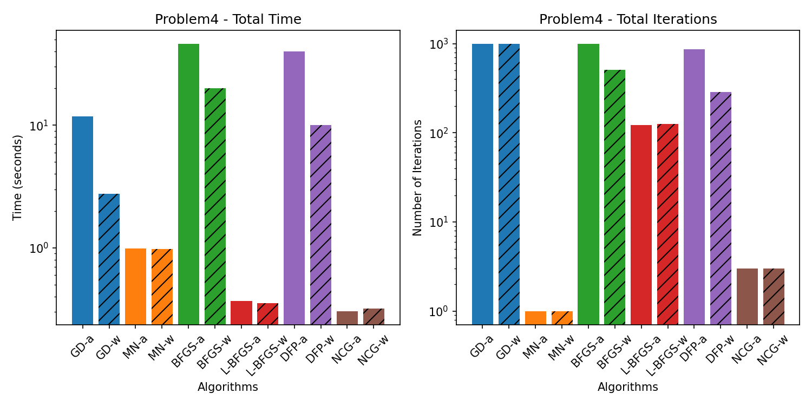
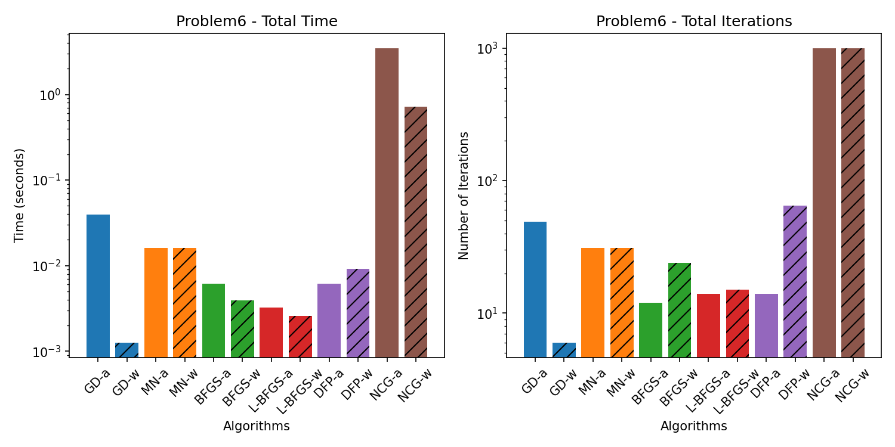
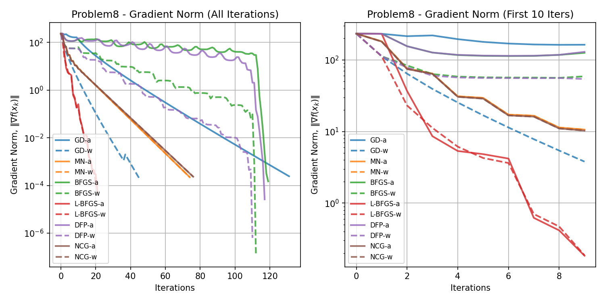
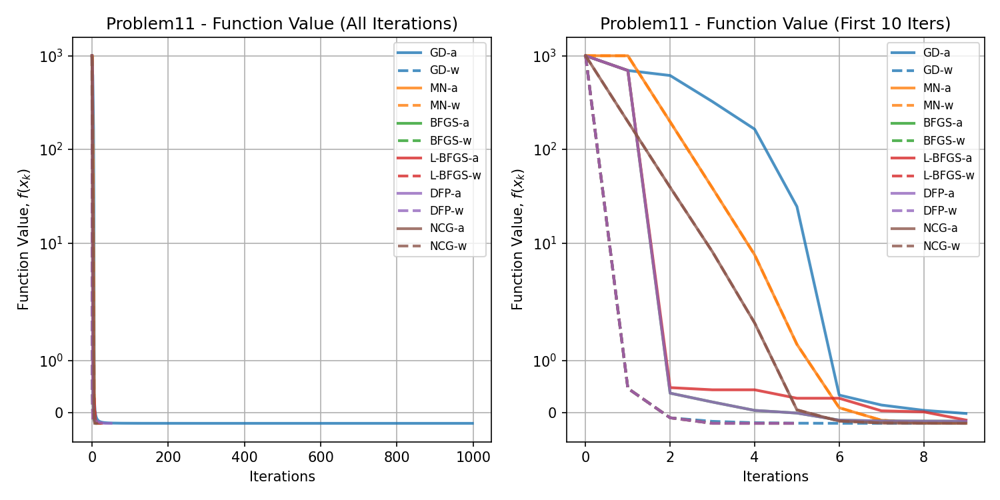
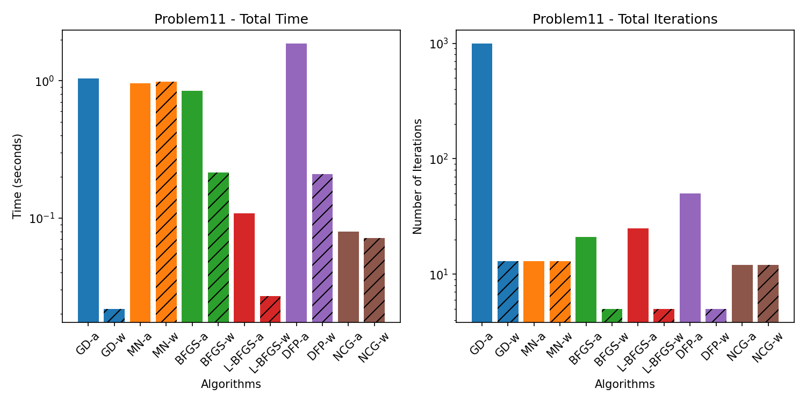
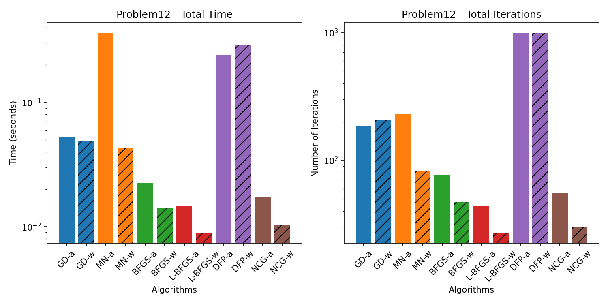

# Algorithms for Non-Linear Programming

## This repository contains implementations of various algorithms for solving non-linear programming problems.

### Getting Started

Install Python 3.10
```bash
sudo apt-get install python3.10-full
```

Install Venv Package
```bash
sudo apt-get install python3-venv
```

Create a virtual environment
```bash
python3.10 -m venv env
```

Activate the virtual environment
```bash
source env/bin/activate
```

Install the required packages
```bash
pip install -r requirements.txt
```

### How to Use:

Run the specific problem script, for example:
```bash
python problem1.py
```

or run the main script to execute all problems:
```bash
python run_all_problems.py
```

## Results

Plots for each problem will be saved in the `figures` directory. Data for each problem will be saved in the `data` directory.

### Problem 1

<!-- BEGIN_PROBLEM_1_TABLE -->

|    | GD-a                                                          | GD-w                                                          | MN-a                                                                 | MN-w                                                                 | BFGS-a                                                        | BFGS-w                                                        | L-BFGS-a                                                      | L-BFGS-w                                                      | DFP-a                                                                    | DFP-w                                                                    | NCG-a                                                                   | NCG-w                                                                   |
|:---|:--------------------------------------------------------------|:--------------------------------------------------------------|:---------------------------------------------------------------------|:---------------------------------------------------------------------|:--------------------------------------------------------------|:--------------------------------------------------------------|:--------------------------------------------------------------|:--------------------------------------------------------------|:-------------------------------------------------------------------------|:-------------------------------------------------------------------------|:------------------------------------------------------------------------|:------------------------------------------------------------------------|
| x  | [[ 1.39929821 -0.10216877 -1.20916162 ...  0.          0.     | [[ 1.39929821 -0.94674395 -1.63822923 ...  0.          0.     | [[ 1.39929821 -0.04418353  0.         ...  0.          0.            | [[ 1.39929821 -0.04418353  0.         ...  0.          0.            | [[ 1.39929821 -0.10216877 -1.35604066 ...  0.          0.     | [[ 1.39929821 -0.94674395 -4.44280601 ...  0.          0.     | [[ 1.39929821 -0.10216877 -0.8347908  ...  0.          0.     | [[ 1.39929821 -0.94674395 -0.8347908  ...  0.          0.     | [-0.04418353 -0.12059312 -0.07392218 -0.10195259 -0.09668032 -0.10425479 | [-0.04418353 -0.12059312 -0.07392217 -0.10195258 -0.09668033 -0.10425479 | [-0.04418353 -0.12059312 -0.07392217 -0.10195259 -0.09668032 -0.1042548 | [-0.04418353 -0.12059312 -0.07392217 -0.10195259 -0.09668032 -0.1042548 |
|    |    0.        ]                                                |    0.        ]                                                |    0.        ]                                                       |    0.        ]                                                       |    0.        ]                                                |    0.        ]                                                |    0.        ]                                                |    0.        ]                                                |  -0.12505469  0.01016127 -0.07622737 -0.11813431]                        |  -0.12505469  0.01016128 -0.07622738 -0.11813431]                        |  -0.12505469  0.01016127 -0.07622737 -0.11813431]                       |  -0.12505469  0.01016127 -0.07622737 -0.11813431]                       |
|    |  [ 1.81745522  0.53818109  1.02123025 ...  0.          0.     |  [ 1.81745522 -0.18141061  0.97043003 ...  0.          0.     |  [ 1.81745522 -0.12059312  0.         ...  0.          0.            |  [ 1.81745522 -0.12059312  0.         ...  0.          0.            |  [ 1.81745522  0.53818109  0.64961981 ...  0.          0.     |  [ 1.81745522 -0.18141061  0.52663123 ...  0.          0.     |  [ 1.81745522  0.53818109  0.81751069 ...  0.          0.     |  [ 1.81745522 -0.18141061  0.81751069 ...  0.          0.     |                                                                          |                                                                          |                                                                         |                                                                         |
|    |    0.        ]                                                |    0.        ]                                                |    0.        ]                                                       |    0.        ]                                                       |    0.        ]                                                |    0.        ]                                                |    0.        ]                                                |    0.        ]                                                |                                                                          |                                                                          |                                                                         |                                                                         |
|    |  [ 1.48650498  0.84305007  0.94166154 ...  0.          0.     |  [ 1.48650498  0.48110668  0.88425029 ...  0.          0.     |  [ 1.48650498 -0.07392218  0.         ...  0.          0.            |  [ 1.48650498 -0.07392218  0.         ...  0.          0.            |  [ 1.48650498  0.84305007  0.77969335 ...  0.          0.     |  [ 1.48650498  0.48110668  0.46408864 ...  0.          0.     |  [ 1.48650498  0.84305007  0.89209757 ...  0.          0.     |  [ 1.48650498  0.48110668  0.89209757 ...  0.          0.     |                                                                          |                                                                          |                                                                         |                                                                         |
|    |    0.        ]                                                |    0.        ]                                                |    0.        ]                                                       |    0.        ]                                                       |    0.        ]                                                |    0.        ]                                                |    0.        ]                                                |    0.        ]                                                |                                                                          |                                                                          |                                                                         |                                                                         |
|    |  ...                                                          |  ...                                                          |  ...                                                                 |  ...                                                                 |  ...                                                          |  ...                                                          |  ...                                                          |  ...                                                          |                                                                          |                                                                          |                                                                         |                                                                         |
|    |  [-2.6487626  -1.99493835 -1.51297205 ...  0.          0.     |  [-2.6487626  -1.62716221 -1.32614955 ...  0.          0.     |  [-2.6487626   0.01016127  0.         ...  0.          0.            |  [-2.6487626   0.01016127  0.         ...  0.          0.            |  [-2.6487626  -1.99493835 -1.44899848 ...  0.          0.     |  [-2.6487626  -1.62716221 -0.10498818 ...  0.          0.     |  [-2.6487626  -1.99493835 -1.67596459 ...  0.          0.     |  [-2.6487626  -1.62716221 -1.67596459 ...  0.          0.     |                                                                          |                                                                          |                                                                         |                                                                         |
|    |    0.        ]                                                |    0.        ]                                                |    0.        ]                                                       |    0.        ]                                                       |    0.        ]                                                |    0.        ]                                                |    0.        ]                                                |    0.        ]                                                |                                                                          |                                                                          |                                                                         |                                                                         |
|    |  [-1.28270149  0.80077764  0.95086575 ...  0.          0.     |  [-1.28270149  1.97273465  1.24035626 ...  0.          0.     |  [-1.28270149 -0.07622737  0.         ...  0.          0.            |  [-1.28270149 -0.07622737  0.         ...  0.          0.            |  [-1.28270149  0.80077764  1.39419644 ...  0.          0.     |  [-1.28270149  1.97273465  3.24118991 ...  0.          0.     |  [-1.28270149  0.80077764  0.93932833 ...  0.          0.     |  [-1.28270149  1.97273465  0.93932833 ...  0.          0.     |                                                                          |                                                                          |                                                                         |                                                                         |
|    |    0.        ]                                                |    0.        ]                                                |    0.        ]                                                       |    0.        ]                                                       |    0.        ]                                                |    0.        ]                                                |    0.        ]                                                |    0.        ]                                                |                                                                          |                                                                          |                                                                         |                                                                         |
|    |  [ 7.8384671   1.3995664   1.20193901 ...  0.          0.     |  [ 7.8384671  -2.22231524  0.36603542 ...  0.          0.     |  [ 7.8384671  -0.11813431  0.         ...  0.          0.            |  [ 7.8384671  -0.11813431  0.         ...  0.          0.            |  [ 7.8384671   1.3995664  -0.21415956 ...  0.          0.     |  [ 7.8384671  -2.22231524 -5.45426804 ...  0.          0.     |  [ 7.8384671   1.3995664   1.14003182 ...  0.          0.     |  [ 7.8384671  -2.22231524  1.14003182 ...  0.          0.     |                                                                          |                                                                          |                                                                         |                                                                         |
|    |    0.        ]]                                               |    0.        ]]                                               |    0.        ]]                                                      |    0.        ]]                                                      |    0.        ]]                                               |    0.        ]]                                               |    0.        ]]                                               |    0.        ]]                                               |                                                                          |                                                                          |                                                                         |                                                                         |
| f  | [456.91323269  68.89765996  22.03903066 ...   0.           0. | [456.91323269 371.78897872  21.27353262 ...   0.           0. | [ 4.56913233e+02 -1.68290135e-01  0.00000000e+00 ...  0.00000000e+00 | [ 4.56913233e+02 -1.68290135e-01  0.00000000e+00 ...  0.00000000e+00 | [456.91323269  68.89765996  22.99806441 ...   0.           0. | [456.91323269 371.78897872 255.61677574 ...   0.           0. | [456.91323269  68.89765996  13.24051152 ...   0.           0. | [456.91323269 371.78897872  13.24051152 ...   0.           0. | [456.91323269  68.89765996  23.41560088 ...   0.           0.            | [456.91323269 371.78897872 221.0248285  ...   0.           0.            | [ 4.56913233e+02 -1.17471770e-01 -1.68289602e-01 ...  0.00000000e+00    | [ 4.56913233e+02 -1.17471770e-01 -1.68289602e-01 ...  0.00000000e+00    |
|    |    0.        ]                                                |    0.        ]                                                |   0.00000000e+00  0.00000000e+00]                                    |   0.00000000e+00  0.00000000e+00]                                    |    0.        ]                                                |    0.        ]                                                |    0.        ]                                                |    0.        ]                                                |    0.        ]                                                           |    0.        ]                                                           |   0.00000000e+00  0.00000000e+00]                                       |   0.00000000e+00  0.00000000e+00]                                       |
| i  | 70                                                            | 64                                                            | 1                                                                    | 1                                                                    | 17                                                            | 20                                                            | 17                                                            | 17                                                            | 14                                                                       | 20                                                                       | 4                                                                       | 4                                                                       |
| t  | 0.013247966766357422                                          | 0.019649505615234375                                          | 0.0012216567993164062                                                | 0.0012562274932861328                                                | 0.004320859909057617                                          | 0.006079196929931641                                          | 0.0059854984283447266                                         | 0.006665706634521484                                          | 0.0038068294525146484                                                    | 0.005976200103759766                                                     | 0.002588033676147461                                                    | 0.0027914047241210938                                                   |
| o  | Converged. Gradient norm is below tolerance.                  | Converged. Gradient norm is below tolerance.                  | Converged. Gradient norm is below tolerance.                         | Converged. Gradient norm is below tolerance.                         | Converged. Gradient norm is below tolerance.                  | Converged. Gradient norm is below tolerance.                  | Converged. Gradient norm is below tolerance.                  | Converged. Gradient norm is below tolerance.                  | Converged. Gradient norm is below tolerance.                             | Converged. Gradient norm is below tolerance.                             | Converged. Gradient norm is below tolerance.                            | Converged. Gradient norm is below tolerance.                            |
| h  | [78.30104369 31.38563956 17.76181735 ...  0.          0.      | [78.30104369 81.21786054 18.46163975 ...  0.          0.      | [7.83010437e+01 1.00680457e-14 0.00000000e+00 ... 0.00000000e+00     | [7.83010437e+01 1.00680457e-14 0.00000000e+00 ... 0.00000000e+00     | [78.30104369 31.38563956 16.81113357 ...  0.          0.      | [78.30104369 81.21786054 55.85758088 ...  0.          0.      | [78.30104369 31.38563956  8.70415902 ...  0.          0.      | [78.30104369 81.21786054  8.70415902 ...  0.          0.      | [78.30104369 31.38563956 17.0206079  ...  0.          0.                 | [78.30104369 81.21786054 51.96637067 ...  0.          0.                 | [7.83010437e+01 5.83176544e-01 2.17023605e-03 ... 0.00000000e+00        | [7.83010437e+01 5.83176544e-01 2.17023605e-03 ... 0.00000000e+00        |
|    |   0.        ]                                                 |   0.        ]                                                 |  0.00000000e+00 0.00000000e+00]                                      |  0.00000000e+00 0.00000000e+00]                                      |   0.        ]                                                 |   0.        ]                                                 |   0.        ]                                                 |   0.        ]                                                 |   0.        ]                                                            |   0.        ]                                                            |  0.00000000e+00 0.00000000e+00]                                         |  0.00000000e+00 0.00000000e+00]                                         |

<!-- END_PROBLEM_1_TABLE -->


### Problem 2


### Problem 3


### Problem 4




### Problem 5


### Problem 6




### Problem 7


### Problem 8



### Problem 9


### Problem 10


### Problem 11




### Problem 12



